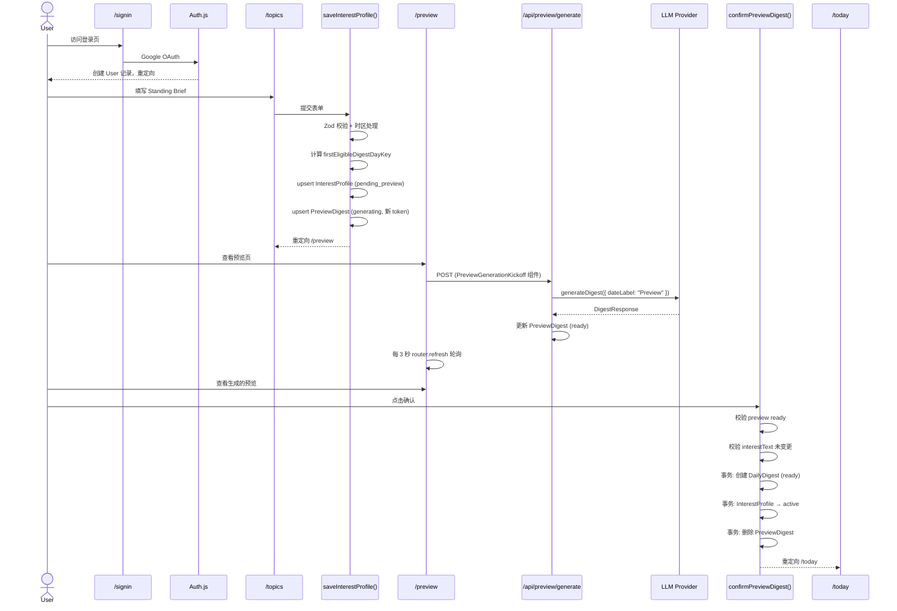
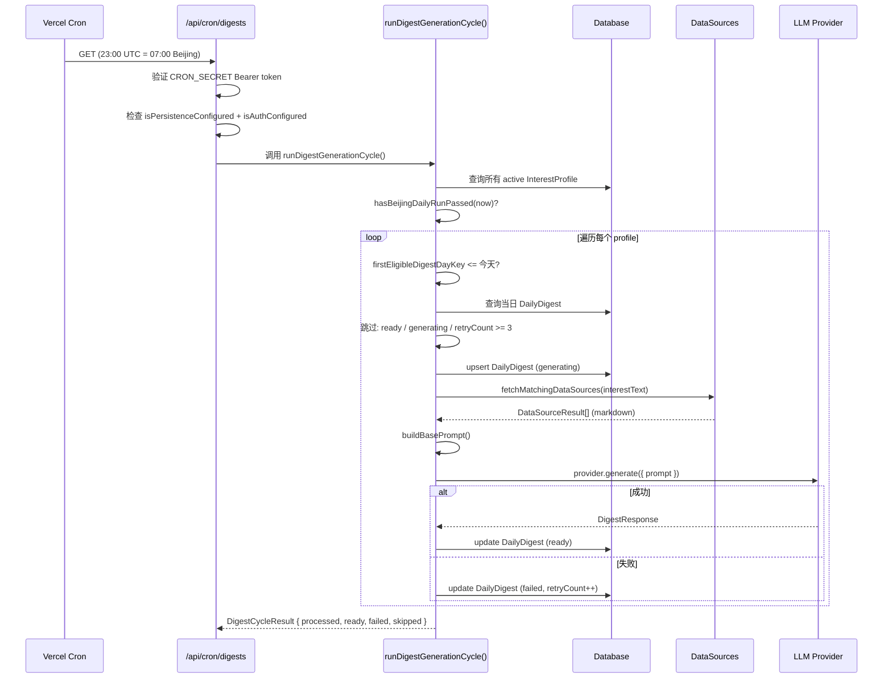
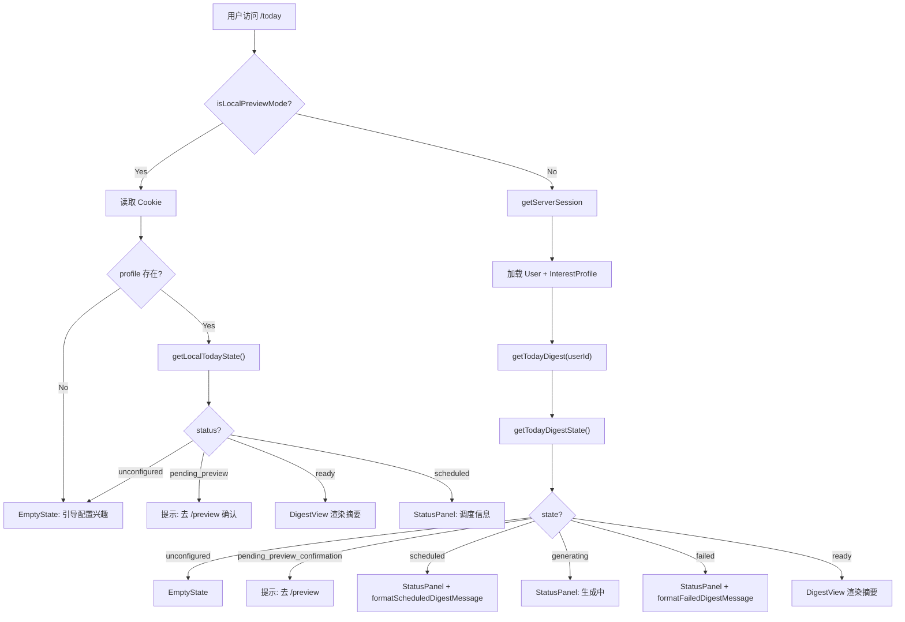

# 核心业务流程

本文档覆盖 Newsi 的三条端到端核心流程，帮助你快速建立对系统全貌的认知。每条流程配有 Mermaid 图和关键代码路径，详细的模块实现请参阅 [modules/](modules/) 下的各模块文档。

---

## 流程一：注册 → 配置兴趣 → 预览 → 确认

这是用户首次使用的完整链路，从注册到开启每日摘要推送。

### 流程图



### 关键步骤说明

**1. 用户注册** → 详见 [modules/auth.md](modules/auth.md)
- Google OAuth 通过 Auth.js 完成
- PrismaAdapter 自动创建 User、Account 记录
- Preview Mode 下跳过认证，使用 cookie 存储状态

**2. 配置兴趣** → 详见 [modules/topics.md](modules/topics.md)
- `src/lib/topics/service.ts:saveInterestProfile()` 是核心入口
- Zod 校验：interestText 2-1000 字符
- 时区处理：浏览器检测 → `normalizeTimezone()` → 存入 User.accountTimezone
- 计算 `firstEligibleDigestDayKey`：北京 07:00 前取今天，07:00 后取明天
- 同时创建 PreviewDigest（status: generating），触发预览生成

**3. 预览生成** → 详见 [modules/preview.md](modules/preview.md)
- `/api/preview/generate` POST 端点
- **DB 路径**：`void startPreviewDigestGeneration()` — fire-and-forget 异步生成
  - generationToken + updatedAt 做乐观锁并发控制
  - 调用 `generateDigest()` → 更新 PreviewDigest
- **Cookie 路径**（Preview Mode）：`completePreviewGeneration()` — 同步生成 mock digest
- 前端 `PreviewGenerationKickoff` 组件每 3 秒 `router.refresh()` 轮询状态

**4. 确认并开启每日摘要** → 详见 [modules/preview.md](modules/preview.md)
- `src/lib/preview-digest/service.ts:confirmPreviewDigest()` 在事务中：
  - 创建/更新 DailyDigest（status: ready，内容从 PreviewDigest 复制）
  - InterestProfile status → active
  - 设置 `firstEligibleDigestDayKey` = 明天
  - 删除 PreviewDigest（一次性使用）
- 重定向到 /today，用户可以看到确认后的摘要

### 双路径说明

系统支持两条并行路径（→ 详见 [modules/auth.md](modules/auth.md)）：
- **数据库路径**（生产模式）：OAuth 认证 + Prisma 持久化 + 真实 LLM 调用
- **Cookie 路径**（Preview Mode）：无需认证/数据库，加密 cookie 存储状态，mock digest

---

## 流程二：每日摘要生成

Vercel Cron 每天 07:00 北京时间触发，批量为所有活跃用户生成摘要。

### 流程图



### 关键步骤说明

**1. Cron 触发** → 详见 [modules/cron.md](modules/cron.md)
- Vercel cron 配置：`0 23 * * *`（23:00 UTC = 07:00 北京时间）
- `src/app/api/cron/digests/route.ts` GET handler
- CRON_SECRET Bearer token 认证
- persistence 或 auth 未配置时直接 skip（返回 `{ ok: true, skipped: "preview-mode" }`）

**2. 批量处理** → 详见 [modules/cron.md](modules/cron.md)
- `src/lib/digest/service.ts:runDigestGenerationCycle()` 核心循环
- 查询所有 `status: "active"` 的 InterestProfile
- `hasBeijingDailyRunPassed(now)` — 北京 07:00 前全部 skip

**3. Per-Profile 处理**
- 跳过条件（幂等保证）：
  - `firstEligibleDigestDayKey > digestDayKey`（尚未到生效日期）
  - 当日 digest 已 ready 或 generating
  - 当日 digest failed 且 `retryCount >= MAX_DIGEST_RETRIES(3)`
- 正常流程：upsert DailyDigest (generating) → `generateDigest()` → 更新结果

**4. 摘要生成** → 详见 [modules/digest-generation.md](modules/digest-generation.md)
- `fetchMatchingDataSources(interestText)` — 自动匹配数据源（→ 详见 [modules/datasources.md](modules/datasources.md)）
- `buildBasePrompt()` — 构建包含日期、兴趣、数据源的 prompt
- `provider.generate()` — 调用 OpenAI 或 Gemini
- 返回 `DigestCycleResult { processed, ready, failed, skipped }`

**5. 错误处理**
- 生成失败：status → failed, retryCount + 1
- `retryCount >= 3`：永久标记失败，该日不再重试
- 下一天重新开始新的循环

---

## 流程三：摘要阅读与历史归档

用户查看当日摘要和历史归档的读取链路。

### 状态决策树



### /today 页面 → 详见 [modules/frontend.md](modules/frontend.md)

`src/app/(app)/today/page.tsx:TodayPage()` — 系统中最复杂的页面，有两套完整的独立渲染路径。

**状态判断逻辑** → 详见 [modules/digest-generation.md](modules/digest-generation.md)
- `src/lib/digest/view-state.ts:getTodayDigestState()` 负责 DB 模式的状态判断
- `src/lib/preview-state.ts:getLocalTodayState()` 负责 Preview 模式的状态判断

**6 种可能的状态**：

| 状态 | 含义 | 展示组件 |
|------|------|---------|
| unconfigured | 无 InterestProfile | EmptyState |
| pending_preview_confirmation | profile 待确认 | 链接到 /preview |
| scheduled | 等待 cron 生成 | StatusPanel |
| generating | 正在生成中 | StatusPanel |
| failed | 生成失败 | StatusPanel |
| ready | 可阅读 | DigestView |

### /history 历史归档

```
/history
  → listArchivedDigests(userId) — 查询所有 DailyDigest，按 digestDayKey 倒序
  → ArchiveList 渲染列表（title, readingTime, status, digestDayKey）

/history/[digestDayKey]
  → getDigestByDayKey(userId, digestDayKey) — 查询特定日期的 digest
  → DigestView 渲染 或 StatusPanel 显示状态
```

关键代码路径：
- `src/lib/digest/service.ts:listArchivedDigests()` — 列表查询
- `src/lib/digest/service.ts:getDigestByDayKey()` — 详情查询
- `src/components/digest/digest-view.tsx:DigestView()` — 摘要渲染
- `src/app/(app)/history/page.tsx` — 列表页
- `src/app/(app)/history/[digestDayKey]/page.tsx` — 详情页

---

## 数据流全景

三条流程覆盖了系统的完整数据生命周期：

```
配置兴趣 → 预览生成 → 确认 → 每日 Cron 生成 → 阅读 → 归档
    │          │         │          │              │        │
    ▼          ▼         ▼          ▼              ▼        ▼
InterestProfile  PreviewDigest  DailyDigest  DailyDigest  DigestView  ArchiveList
(pending_preview) (generating→   (ready,      (scheduled→              (按日期
                    ready)       从 preview   generating→               倒序)
                                  复制)       ready/failed)
```

更多细节请深入各模块文档：
- [modules/auth.md](modules/auth.md) — 认证与用户模型
- [modules/topics.md](modules/topics.md) — 兴趣配置
- [modules/digest-generation.md](modules/digest-generation.md) — 摘要生成核心逻辑
- [modules/preview.md](modules/preview.md) — 预览流程
- [modules/cron.md](modules/cron.md) — 定时任务与批量生成
- [modules/datasources.md](modules/datasources.md) — 外部数据源
- [modules/frontend.md](modules/frontend.md) — 前端组件与页面路由
- [data-model.md](data-model.md) — 数据模型
