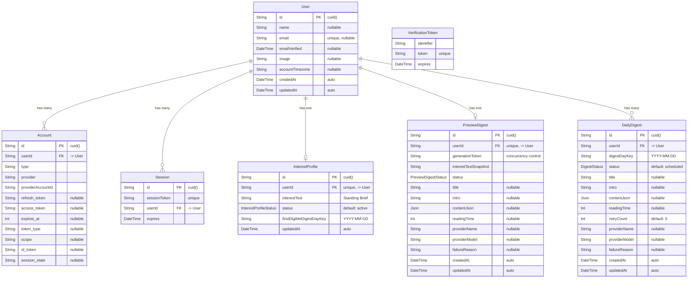

# 数据模型

## 概述

Newsi 是一个基于 AI 的个性化新闻摘要服务。用户提交自己的兴趣描述 (Standing Brief)，系统通过 LLM Provider 生成预览摘要供用户确认，确认后每日自动生成个性化新闻摘要。

数据层基于 **PostgreSQL** + **Prisma ORM** 构建，共定义 3 个 Enum、7 张表。数据模型围绕两条核心流程设计：

1. **Onboarding 流程**：用户设置兴趣 → 生成预览 → 确认预览 → 激活每日摘要
2. **每日生成流程**：Cron 定时批量扫描活跃用户 → 调用 LLM 生成摘要 → 写入 DailyDigest

Schema 文件位于 `prisma/schema.prisma`，所有业务逻辑通过 Prisma Client 访问数据库。

## 架构图



## 枚举类型

### DigestStatus

每日摘要的生命周期状态：

| 值 | 含义 |
|---|---|
| `scheduled` | 已创建记录，等待 Cron 拾取生成 |
| `generating` | 正在调用 LLM 生成中 |
| `failed` | 生成失败，可能会被 Cron 重试 |
| `ready` | 生成成功，可供用户阅读 |

### InterestProfileStatus

兴趣配置的确认状态：

| 值 | 含义 |
|---|---|
| `pending_preview` | 用户已提交 Standing Brief，等待预览确认 |
| `active` | 预览已确认，Cron 可为该用户生成每日摘要 |

### PreviewDigestStatus

预览摘要的生成状态：

| 值 | 含义 |
|---|---|
| `generating` | 正在生成预览摘要 |
| `failed` | 预览生成失败，用户可重试 |
| `ready` | 预览已就绪，用户可查看并确认 |

## 核心表详解

### User -- 用户信息

Auth.js 标准用户表，扩展了 `accountTimezone` 字段用于时区感知的摘要生成。

- **主键**：`id` (cuid)
- **唯一约束**：`email`
- **扩展字段**：`accountTimezone` 在用户首次保存兴趣时由浏览器时区推断并写入（参见 `src/lib/topics/service.ts:saveInterestProfile()`）
- **关联关系**：作为所有业务表的父实体，所有子表均配置 `onDelete: Cascade`

### Account -- OAuth 账号

Auth.js 标准 OAuth 账号表，存储第三方登录凭证（如 Google OAuth）。

- **复合唯一约束**：`[provider, providerAccountId]` 确保同一 Provider 下账号不重复
- **级联删除**：User 删除时自动清理

### Session -- 用户会话

Auth.js 标准会话表。

- **唯一约束**：`sessionToken`
- **级联删除**：User 删除时自动清理

### VerificationToken -- 验证令牌

Auth.js 内部使用的邮箱验证令牌表。**应用代码不直接操作此表**，完全由 Auth.js 内部管理。

- **复合唯一约束**：`[identifier, token]`
- **注意**：此表无 `id` 主键，也不关联 User 表

### InterestProfile -- 兴趣配置

存储用户的 Standing Brief（兴趣描述文本），是整个摘要生成流程的起点。

- **唯一约束**：`userId`（1:1 关系，每个用户只有一份兴趣配置）
- **核心字段**：
  - `interestText`：用户撰写的兴趣描述，作为 LLM prompt 的核心输入
  - `status`：控制 Cron 是否为该用户生成摘要。只有 `active` 状态的 Profile 会被 `src/lib/digest/service.ts:runDigestGenerationCycle()` 扫描
  - `firstEligibleDigestDayKey`：格式为 `YYYY-MM-DD`，用户确认预览后设置为次日日期，防止用户确认当天又收到一份重复摘要（当天的摘要已通过预览确认流程写入 DailyDigest）

**关键代码路径**：

- 创建/更新：`src/lib/topics/service.ts:saveInterestProfile()` -- 始终将 status 设为 `pending_preview`
- 激活：`src/lib/preview-digest/service.ts:confirmPreviewDigest()` -- 在事务中将 status 改为 `active`
- 清理：`src/lib/topics/service.ts:clearInterestProfile()` -- 删除 InterestProfile 和 PreviewDigest，**但保留 DailyDigest**

### PreviewDigest -- 预览摘要

用户提交 Standing Brief 后生成的预览摘要，用户确认后会被转为当天的 DailyDigest 然后删除。

- **唯一约束**：`userId`（1:1 关系，每用户最多一个预览）
- **核心字段**：
  - `generationToken`：每次触发生成时创建新的 UUID，用于防止并发竞态（详见「关键设计决策」章节）
  - `interestTextSnapshot`：生成时的兴趣文本快照，用于确认时检测用户是否修改了 Standing Brief
  - `contentJson`：LLM 返回的结构化摘要内容，类型为 `Json`（PostgreSQL JSONB）

**关键代码路径**：

- 创建：`src/lib/topics/service.ts:saveInterestProfile()` -- 与 InterestProfile 一同创建，初始 status 为 `generating`
- 异步生成：`src/lib/preview-digest/service.ts:startPreviewDigestGeneration()` -- 通过 `generationToken` 乐观锁 claim 后调用 LLM
- 确认转化：`src/lib/preview-digest/service.ts:confirmPreviewDigest()` -- 事务内将预览内容写入 DailyDigest，激活 InterestProfile，然后删除 PreviewDigest
- 重试：`src/lib/preview-digest/service.ts:retryPreviewDigest()` -- 重置 status 为 `generating`，生成新 `generationToken`

### DailyDigest -- 每日摘要

系统的最终产出物，每个用户每天最多一条摘要记录。

- **复合唯一约束**：`[userId, digestDayKey]` 确保同用户同日幂等
- **核心字段**：
  - `digestDayKey`：格式为 `YYYY-MM-DD`，基于北京时区（`Asia/Shanghai`）计算。参见 `src/lib/timezone.ts:getBeijingDigestDayKey()`
  - `status`：生命周期状态，默认 `scheduled`
  - `retryCount`：失败重试计数，达到 `MAX_DIGEST_RETRIES`（值为 3）后永久放弃。参见 `src/lib/digest/service.ts:MAX_DIGEST_RETRIES`
  - `contentJson`：LLM 生成的结构化摘要内容，使用 Zod schema 解析验证（`src/lib/digest/schema.ts`）
  - `providerName` / `providerModel`：记录生成该摘要所用的 LLM Provider 和模型信息

**关键代码路径**：

- Cron 批量生成：`src/lib/digest/service.ts:runDigestGenerationCycle()` -- 扫描所有 `active` 状态的 InterestProfile，对每个满足条件的用户 upsert DailyDigest 并调用 LLM
- 预览确认写入：`src/lib/preview-digest/service.ts:confirmPreviewDigest()` -- 将预览摘要内容直接作为当日 DailyDigest 写入
- 查询：`src/lib/digest/service.ts:getDigestByDayKey()` 和 `getTodayDigest()`
- 归档列表：`src/lib/digest/service.ts:listArchivedDigests()`

## 关键设计决策

### 1. InterestProfile `@default(active)` vs 代码中的 `pending_preview`

Prisma Schema 定义了 `status` 的默认值为 `active`：

```prisma
status InterestProfileStatus @default(active)
```

但是 `src/lib/topics/service.ts:saveInterestProfile()` 在创建和更新时始终显式设为 `pending_preview`：

```typescript
await db.interestProfile.upsert({
  where: { userId },
  update: { interestText: data.interestText, status: "pending_preview" },
  create: { userId, interestText: data.interestText, status: "pending_preview", ... },
});
```

**设计意图**：Schema 的 `@default(active)` 是为了直接数据库操作（如 seed 脚本、数据修复）提供合理默认值。应用层的所有用户操作必须经过 preview 确认流程，因此代码层强制设置 `pending_preview`。`runDigestGenerationCycle()` 只扫描 `active` 状态的 Profile，这保证了未确认预览的用户不会收到每日摘要。

### 2. `interestTextSnapshot` -- 防过期检测

PreviewDigest 存储了生成时的兴趣文本快照 `interestTextSnapshot`。在 `src/lib/preview-digest/service.ts:confirmPreviewDigest()` 中，系统会将当前 InterestProfile 的 `interestText` 与快照进行比对：

```typescript
if (interestProfile.interestText !== previewDigest.interestTextSnapshot) {
  throw new Error("Preview digest is stale. Regenerate it from the latest Topics.");
}
```

**设计意图**：如果用户在预览生成后修改了 Standing Brief，旧的预览内容已不匹配最新兴趣，此时应阻止确认并要求重新生成。这避免了用户误确认一份与当前兴趣不一致的摘要。

### 3. `generationToken` -- 并发控制

PreviewDigest 的 `generationToken` 是一个 UUID，每次触发生成时更新。在 `src/lib/preview-digest/service.ts:startPreviewDigestGeneration()` 中，系统使用 `updateMany` 配合 `generationToken` + `updatedAt` 条件来实现乐观锁：

```typescript
const claimed = await db.previewDigest.updateMany({
  where: {
    userId,
    status: "generating",
    generationToken: previewDigest.generationToken,
    updatedAt: previewDigest.updatedAt,
  },
  data: { updatedAt: new Date() },
});

if (claimed.count === 0) {
  return { started: false };
}
```

**设计意图**：预览生成是异步操作，用户可能在生成过程中重新提交 Standing Brief。此时 `saveInterestProfile()` 会写入新的 `generationToken`，导致旧的生成任务在 claim 阶段失败（`count === 0`），从而安全退出。这避免了旧结果覆盖新请求的竞态条件。

### 4. `[userId, digestDayKey]` 复合唯一约束 -- 幂等生成

DailyDigest 的 `@@unique([userId, digestDayKey])` 确保了同一用户同一天只能有一条摘要记录。`runDigestGenerationCycle()` 使用 `upsert` 操作配合此约束，保证即使 Cron 重复运行也不会产生重复记录。

### 5. 级联删除策略 -- 有选择的清理

所有子表都配置了 `onDelete: Cascade`，即 User 删除时所有关联数据自动清理。但在业务层面，`src/lib/topics/service.ts:clearInterestProfile()` 只删除 PreviewDigest 和 InterestProfile：

```typescript
export async function clearInterestProfile(userId: string) {
  await db.previewDigest.deleteMany({ where: { userId } });
  await db.interestProfile.deleteMany({ where: { userId } });
}
```

**设计意图**：用户清除兴趣配置时，已生成的历史 DailyDigest 作为归档保留，用户仍可回顾过去的摘要。只有彻底删除账号时才会通过级联删除清理所有数据。

### 6. `firstEligibleDigestDayKey` -- 防重复摘要

确认预览时，`confirmPreviewDigest()` 将预览内容写入当天的 DailyDigest，同时将 `firstEligibleDigestDayKey` 设为**次日**：

```typescript
const firstEligibleDigestDayKey = getNextBeijingDigestDayKey(now);
```

`runDigestGenerationCycle()` 在处理每个用户时会检查：

```typescript
if (profile.firstEligibleDigestDayKey > digestDayKey) {
  result.skipped += 1;
  continue;
}
```

**设计意图**：预览确认当天的摘要已通过预览流程写入，Cron 不应再为该用户重复生成当天摘要。`firstEligibleDigestDayKey` 设为次日，确保 Cron 从第二天开始正常生成。

## 迁移历史

| 迁移 | 内容 |
|---|---|
| `20260322000000_init_auth_and_digest` | 初始化 Auth.js 三表（User、Account、Session）+ VerificationToken + InterestProfile + DailyDigest，以及 `DigestStatus` 枚举 |
| `20260322130000_add_preview_confirmation` | 新增 `InterestProfileStatus` 和 `PreviewDigestStatus` 枚举，为 InterestProfile 添加 `status` 列，创建 PreviewDigest 表 |

## 注意事项

1. **时区依赖**：`digestDayKey` 和 `firstEligibleDigestDayKey` 均基于北京时区 (`Asia/Shanghai`) 计算，与用户自身的 `accountTimezone` 无关。时区转换逻辑集中在 `src/lib/timezone.ts`。

2. **JSON 字段处理**：`contentJson` 存储为 PostgreSQL JSONB，读取后需通过 Zod schema (`src/lib/digest/schema.ts:digestResponseSchema`) 进行运行时类型验证。直接使用 `contentJson` 前务必调用 `parseStoredDigestContent()` 验证结构。

3. **PreviewDigest 的临时性**：PreviewDigest 是一个临时过渡记录，在 `confirmPreviewDigest()` 的事务中会被删除。正常流程中，数据库中的 PreviewDigest 记录要么处于 `generating`/`failed`/`ready` 等待用户操作，要么已被删除。不要依赖 PreviewDigest 做持久化数据存储。

4. **重试上限**：DailyDigest 的 `retryCount` 达到 `MAX_DIGEST_RETRIES`（3）后，`runDigestGenerationCycle()` 将永久跳过该记录。如需人工干预，需直接操作数据库重置 `retryCount` 和 `status`。

5. **VerificationToken 独立性**：此表没有外键关联 User，也没有 `id` 主键，完全由 Auth.js 框架内部管理。开发业务功能时不需要关注此表。

6. **clearInterestProfile 不删除 DailyDigest**：这是有意为之的设计，详见「关键设计决策」第 5 点。如果误以为清除兴趣会清除历史摘要，可能导致逻辑错误。
