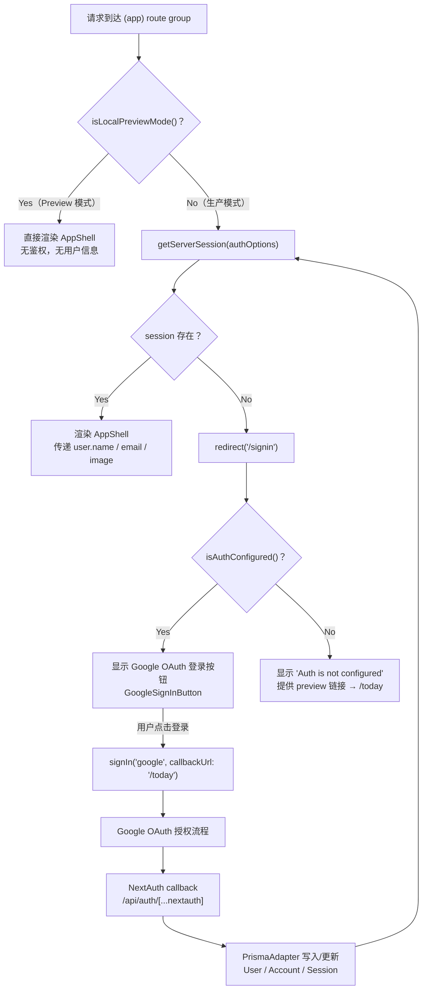

# 认证与用户模型

## 概述

Newsi 采用 Auth.js (NextAuth.js) + Google OAuth 构建认证体系。整个系统设计围绕一个核心原则：**让开发者零配置即可体验核心功能，同时在生产环境提供完整的认证保护**。

为此，系统实现了 **生产模式（Production Mode）** 和 **Preview 模式（Local Preview Mode）** 双轨运行机制：

- **生产模式**：完整的 Google OAuth 登录流程，session 持久化到数据库，未认证用户被重定向到 `/signin` 登录页。
- **Preview 模式**：跳过所有鉴权检查，直接渲染页面内容。仅在非 production 环境下生效，目的是让开发者在本地无需配置 OAuth credentials 和数据库就能启动应用。

这套双轨机制通过 `src/lib/env.ts` 中的 6 个环境检测函数和 `src/app/(app)/layout.tsx` 中的鉴权守卫协同实现。

### 涉及的关键文件

| 文件路径 | 职责 |
|---------|------|
| `src/lib/env.ts` | 环境检测函数，判断运行模式 |
| `src/lib/auth.ts` | Auth.js 配置（`authOptions`） |
| `src/lib/db.ts` | Prisma 数据库客户端，条件初始化 |
| `src/app/(app)/layout.tsx` | 鉴权守卫，Server Component |
| `src/app/api/auth/[...nextauth]/route.ts` | NextAuth catch-all API 路由 |
| `src/app/signin/page.tsx` | 登录页面 |
| `src/components/auth/google-sign-in-button.tsx` | Google 登录按钮（Client Component） |

---

## 架构图

以下 Mermaid flowchart 展示了请求到达后的完整鉴权流程：



---

## 核心逻辑

### 1. 运行模式检测 (`src/lib/env.ts`)

这是整个认证系统的基石。6 个纯函数层层组合，最终决定应用以哪种模式运行。

```typescript
// src/lib/env.ts

export function isLocalPreviewForced() {
  return process.env.FORCE_LOCAL_PREVIEW === "1";
}

export function isPersistenceConfigured() {
  return Boolean(process.env.DATABASE_URL);
}

export function isAuthSecretConfigured() {
  return Boolean(process.env.AUTH_SECRET);
}

export function isGoogleAuthConfigured() {
  return Boolean(process.env.AUTH_GOOGLE_ID && process.env.AUTH_GOOGLE_SECRET);
}

export function isAuthConfigured() {
  return (
    isPersistenceConfigured() &&
    isAuthSecretConfigured() &&
    isGoogleAuthConfigured()
  );
}

export function isLocalPreviewMode() {
  return (
    process.env.NODE_ENV !== "production" &&
    (isLocalPreviewForced() || !isAuthConfigured())
  );
}
```

**函数依赖关系：**

- `isAuthConfigured()` = `isPersistenceConfigured()` AND `isAuthSecretConfigured()` AND `isGoogleAuthConfigured()`
- `isLocalPreviewMode()` = 非 production 环境 AND（强制预览 OR auth 未配置）

**实际含义：**

| 场景 | NODE_ENV | 环境变量 | isLocalPreviewMode() | 行为 |
|------|----------|---------|---------------------|------|
| 本地开发，未配 DB | development | 缺少 DATABASE_URL | `true` | Preview 模式 |
| 本地开发，全部配齐 | development | 全部齐全 | `false` | 走 OAuth 流程 |
| 本地开发，强制 preview | development | FORCE_LOCAL_PREVIEW=1 | `true` | Preview 模式（即使全配齐） |
| 生产环境 | production | 全部齐全 | `false` | 走 OAuth 流程 |
| 生产环境，强制 preview | production | FORCE_LOCAL_PREVIEW=1 | `false` | 仍走 OAuth（production 屏蔽） |

### 2. Auth.js 配置 (`src/lib/auth.ts:authOptions`)

`authOptions` 是 NextAuth.js 的核心配置对象。它使用一个**条件三元表达式**根据 `isAuthConfigured()` 的返回值在模块顶层决定配置内容：

```typescript
// src/lib/auth.ts

export const authOptions: NextAuthOptions = isAuthConfigured()
  ? {
      // ========== 生产分支 ==========
      secret: process.env.AUTH_SECRET,
      adapter: PrismaAdapter(db!),
      providers: [
        GoogleProvider({
          clientId: process.env.AUTH_GOOGLE_ID ?? "",
          clientSecret: process.env.AUTH_GOOGLE_SECRET ?? "",
        }),
      ],
      pages: {
        signIn: "/signin",
      },
      session: {
        strategy: "database",
      },
    }
  : {
      // ========== 降级分支 ==========
      secret: process.env.AUTH_SECRET,
      providers: [],
      pages: {
        signIn: "/signin",
      },
      session: {
        strategy: "jwt",
      },
    };
```

**生产分支关键点：**

- **`PrismaAdapter(db!)`**：将 Auth.js 的 User、Account、Session、VerificationToken 模型委托给 Prisma 管理。这里使用 `db!` 非空断言是安全的，因为 `isAuthConfigured()` 已经确认 `DATABASE_URL` 存在，`db` 不会为 `null`。
- **`GoogleProvider`**：配置 Google OAuth 2.0，需要 `AUTH_GOOGLE_ID` 和 `AUTH_GOOGLE_SECRET` 两个环境变量。
- **`session.strategy: "database"`**：session 数据存储在数据库中，而非 JWT token 里。
- **`pages.signIn: "/signin"`**：自定义登录页，覆盖 NextAuth 默认的 `/api/auth/signin`。

**降级分支关键点：**

- **无 `adapter`**：不连接数据库，避免 PrismaAdapter 在无 DB 时抛错。
- **`providers: []`**：空 provider 数组，实际上无法执行任何登录流程。
- **`session.strategy: "jwt"`**：没有 adapter 就不能用 database strategy，退回 JWT。
- 降级分支在 Preview 模式下实际不会被调用（鉴权守卫直接跳过了 session 检查），它的存在只是为了让 `authOptions` 导出一个合法的 NextAuthOptions 对象，避免模块加载时报错。

### 3. 数据库客户端 (`src/lib/db.ts`)

数据库客户端也采用条件初始化，与 auth 配置联动：

```typescript
// src/lib/db.ts

export function createPrismaClient() {
  if (!isPersistenceConfigured()) {
    return null;  // 无 DATABASE_URL 时返回 null
  }

  const adapter = new PrismaPg({
    connectionString: process.env.DATABASE_URL!,
  });

  return new PrismaClient({
    adapter,
    log: process.env.NODE_ENV === "development" ? ["warn", "error"] : ["error"],
  });
}

export const db = globalForPrisma.prisma ?? createPrismaClient();
```

`db` 可能为 `null`。在生产分支中 `PrismaAdapter(db!)` 使用非空断言是安全的，因为 `isAuthConfigured()` 已确保 `isPersistenceConfigured()` 为 `true`。

全局缓存 `globalForPrisma.prisma` 防止开发环境 HMR 导致多次实例化 PrismaClient。

### 4. 鉴权守卫 (`src/app/(app)/layout.tsx:AppLayout`)

这是整个应用中**唯一的鉴权检查点**。它是一个 Server Component，作为 `(app)` route group 的 layout，保护该 group 下所有页面。

```typescript
// src/app/(app)/layout.tsx

export default async function AppLayout({
  children,
}: Readonly<{
  children: React.ReactNode;
}>) {
  // Preview 模式：跳过一切鉴权
  if (isLocalPreviewMode()) {
    return <AppShell>{children}</AppShell>;
  }

  // 生产模式：检查 session
  const session = await getServerSession(authOptions);

  if (!session?.user) {
    redirect("/signin");
  }

  // 有 session：传递用户信息到 AppShell
  return (
    <AppShell
      user={{
        name: session.user.name,
        email: session.user.email,
        image: session.user.image,
      }}
    >
      {children}
    </AppShell>
  );
}
```

**执行流程：**

1. 先检查 `isLocalPreviewMode()`。如果是 Preview 模式，直接渲染 `<AppShell>` 并传入 `children`，此时 `user` prop 为 `undefined`，导航栏不显示用户信息。
2. 如果是生产模式，调用 `getServerSession(authOptions)` 从数据库读取 session。
3. 无有效 session 则 `redirect("/signin")`，这是 Next.js 的服务端重定向，返回 307 响应。
4. 有有效 session 则将 `user.name`、`user.email`、`user.image` 传递给 `AppShell`，由 `SideNav` 组件在侧边栏展示用户头像和信息。

**关键细节：** Newsi 没有使用 Next.js middleware 做鉴权。所有鉴权逻辑集中在这个 layout.tsx 中。这意味着 `(app)` route group 之外的路由（如 `/signin`、`/api/auth/*`）不受鉴权保护，这是预期行为。

### 5. NextAuth API 路由 (`src/app/api/auth/[...nextauth]/route.ts`)

标准的 NextAuth catch-all 路由，处理所有 `/api/auth/*` 请求：

```typescript
// src/app/api/auth/[...nextauth]/route.ts

import NextAuth from "next-auth";
import { authOptions } from "@/lib/auth";

const handler = NextAuth(authOptions);

export { handler as GET, handler as POST };
```

该路由处理以下端点：

- `GET /api/auth/signin` — 登录页（被 `pages.signIn` 覆盖）
- `GET /api/auth/signout` — 登出确认页
- `POST /api/auth/signout` — 执行登出
- `GET /api/auth/session` — 获取当前 session
- `GET /api/auth/csrf` — 获取 CSRF token
- `GET /api/auth/providers` — 获取可用 provider 列表
- `GET/POST /api/auth/callback/google` — Google OAuth callback

### 6. 登录页 (`src/app/signin/page.tsx`)

登录页根据 `isAuthConfigured()` 和 `isLocalPreviewMode()` 动态展示不同内容：

```typescript
// src/app/signin/page.tsx

export default function SignInPage() {
  const authConfigured = isAuthConfigured() && !isLocalPreviewMode();

  return (
    <main>
      {/* 品牌标识 + 标题 + 副标题 */}

      {/* Auth 已配置：显示 Google 登录按钮 */}
      {authConfigured ? <GoogleSignInButton /> : null}

      {/* Auth 未配置：显示提示和 preview 链接 */}
      {!authConfigured ? (
        <div>
          <p>Auth is not configured in this environment.</p>
          <Link href="/today">or explore a preview →</Link>
        </div>
      ) : null}
    </main>
  );
}
```

`GoogleSignInButton` 是一个 Client Component，点击时调用 `signIn("google", { callbackUrl: "/today" })`，发起 Google OAuth 授权流程，成功后重定向到 `/today`。

---

## 关键设计决策

### 为什么选择 database session 策略而非 JWT？

Auth.js 支持两种 session 策略：`jwt` 和 `database`。Newsi 在生产模式下选择了 `database` 策略，原因如下：

1. **与 PrismaAdapter 天然配合**：PrismaAdapter 已经管理了 User、Account 等模型，session 也存在数据库中保持了数据模型的统一性。
2. **服务端可控**：database session 允许服务端随时撤销某个用户的 session（直接删除数据库记录即可），而 JWT 一旦签发就无法撤销（除非实现 token 黑名单）。
3. **无 token 大小限制**：JWT 会随着 claims 增多而变大，影响 cookie 体积和请求性能。database session 的 cookie 中只存储一个 session ID。

### 为什么需要 Preview Mode？

Preview Mode 的设计目标是**降低开发者的上手门槛**：

- 新开发者 clone 项目后，不需要配置 Google Cloud OAuth credentials。
- 不需要配置 PostgreSQL 数据库。
- `pnpm dev` 即可看到完整的 UI 和功能。

这对于前端开发、UI 调试、demo 演示等场景尤其有价值。

### 为什么 `authOptions` 使用条件三元表达式？

`PrismaAdapter(db!)` 会在模块加载时立即执行。如果 `db` 为 `null`（无 DATABASE_URL），`PrismaAdapter` 会抛出运行时错误。通过条件表达式，在 `isAuthConfigured()` 返回 `false` 时走降级分支，完全避开 `PrismaAdapter` 的调用。

另一种方案是使用 lazy initialization（惰性初始化），但三元表达式更直观，且 `authOptions` 是模块级常量，在应用生命周期内只初始化一次，lazy init 带来的复杂度并不值得。

### 为什么鉴权守卫放在 layout.tsx 而非 middleware？

Next.js middleware 运行在 Edge Runtime，而 `getServerSession` 需要访问数据库（通过 PrismaAdapter），Edge Runtime 对 Node.js API 的支持有限。将鉴权逻辑放在 Server Component layout 中，可以在 Node.js Runtime 下执行完整的 session 验证。

此外，layout.tsx 作为 route group 的入口，天然地为该 group 下的所有子路由提供保护，语义清晰。

---

## 注意事项

### AUTH_SECRET 必须正确配置

`AUTH_SECRET` 是 Auth.js 用于加密 session cookie 和 CSRF token 的密钥。无论生产分支还是降级分支，`authOptions` 都引用了 `process.env.AUTH_SECRET`。如果在生产环境中缺少该变量，Auth.js 会在运行时抛出加密相关错误。

可以使用 `openssl rand -base64 32` 生成一个随机密钥。

### Preview Mode 下 session 行为

Preview 模式下，`authOptions` 走降级分支：`providers` 为空数组，`session.strategy` 为 `jwt`。这意味着：

- 即使访问 `/api/auth/signin`，也没有任何 provider 可选。
- `getServerSession` 会返回 `null`（因为没有有效的 JWT）。
- 但这没有影响，因为鉴权守卫在 `isLocalPreviewMode()` 检查通过后直接跳过了 session 验证。

### isLocalPreviewMode 的 production 安全阀

`isLocalPreviewMode()` 的第一个条件是 `process.env.NODE_ENV !== "production"`。这是一个安全阀：

```typescript
export function isLocalPreviewMode() {
  return (
    process.env.NODE_ENV !== "production" &&  // <-- 安全阀
    (isLocalPreviewForced() || !isAuthConfigured())
  );
}
```

即使有人在生产环境中误设了 `FORCE_LOCAL_PREVIEW=1`，`isLocalPreviewMode()` 仍然返回 `false`，不会跳过鉴权。这确保了生产环境的认证保护无法被绕过。

### 鉴权守卫的作用范围

`src/app/(app)/layout.tsx` 是 `(app)` route group 的 layout，它只保护该 group 内的路由。以下路由不受保护（且是预期行为）：

- `/signin` — 登录页本身不需要鉴权
- `/api/auth/*` — NextAuth 的 API 端点需要对外暴露
- 其他不在 `(app)` group 中的路由

如果未来新增页面路由，需要确保将其放置在 `(app)` route group 内，否则该页面不会受到鉴权保护。

### 环境变量清单

| 变量名 | 必需性 | 说明 |
|--------|-------|------|
| `AUTH_SECRET` | 生产环境必需 | Auth.js 加密密钥，`openssl rand -base64 32` 生成 |
| `AUTH_GOOGLE_ID` | 生产环境必需 | Google Cloud OAuth 2.0 Client ID |
| `AUTH_GOOGLE_SECRET` | 生产环境必需 | Google Cloud OAuth 2.0 Client Secret |
| `DATABASE_URL` | 生产环境必需 | PostgreSQL 连接字符串 |
| `FORCE_LOCAL_PREVIEW` | 可选 | 设为 `"1"` 强制启用 Preview 模式（仅非 production 环境生效） |
