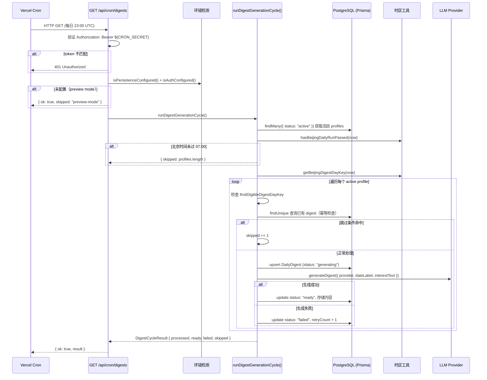

# 定时任务与批量生成

## 概述

Newsi 的核心价值之一是**每天早上用户醒来就能看到为自己定制的新闻摘要**。实现这一体验的关键基础设施就是 cron 定时任务模块。

该模块由三部分组成：

1. **Vercel Cron 调度器**：每天 UTC 23:00（北京时间 07:00）自动触发 HTTP 请求。
2. **API 端点** `GET /api/cron/digests`：接收 cron 请求，执行鉴权和前置条件检查。
3. **批量生成引擎** `runDigestGenerationCycle()`：遍历所有活跃用户的 interest profile，逐个调用 LLM 生成当日摘要，并将结果持久化到数据库。

整个流程设计遵循三大原则：**幂等性**（同用户同日不重复生成）、**容错性**（失败自动重试，最多 3 次）、**串行安全**（逐个处理避免 LLM API 限流）。

### 涉及的关键文件

| 文件路径 | 职责 |
|---------|------|
| `vercel.json` | Vercel Cron schedule 配置 |
| `src/app/api/cron/digests/route.ts` | Cron API 端点，鉴权 + 前置检查 |
| `src/lib/digest/service.ts` | 核心生成逻辑，`runDigestGenerationCycle()` |
| `src/lib/timezone.ts` | 时区工具函数，北京时间判定 |
| `src/lib/env.ts` | 环境检测函数 |
| `src/lib/digest/provider.ts` | LLM provider 抽象层（OpenAI / Gemini） |
| `prisma/schema.prisma` | 数据模型定义（`DailyDigest`、`InterestProfile`） |

---

## 架构图

以下 Mermaid sequenceDiagram 展示了从 Vercel Cron 触发到摘要生成完成的完整流程：



---

## 核心逻辑

### 1. Vercel Cron 配置 (`vercel.json`)

Vercel Cron 是 Vercel 平台提供的 serverless 定时任务调度器。配置极为简洁：

```json
{
  "crons": [
    {
      "path": "/api/cron/digests",
      "schedule": "0 23 * * *"
    }
  ]
}
```

- **`path`**：cron 触发时 Vercel 会向该路径发起 `GET` 请求。
- **`schedule`**：标准 cron 表达式 `0 23 * * *`，表示每天 UTC 23:00 执行。UTC 23:00 对应**北京时间（Asia/Shanghai）07:00**，即中国用户的早间时段。

Vercel 在触发 cron 请求时，会自动在 `Authorization` header 中携带 `Bearer ${CRON_SECRET}`，其中 `CRON_SECRET` 是在 Vercel 项目环境变量中配置的密钥。

### 2. API 端点 (`src/app/api/cron/digests/route.ts`)

API 端点是一个标准的 Next.js Route Handler，仅暴露 `GET` method。完整代码如下：

```typescript
// src/app/api/cron/digests/route.ts

import { runDigestGenerationCycle } from "@/lib/digest/service";
import { isAuthConfigured, isPersistenceConfigured } from "@/lib/env";

export async function GET(request: Request) {
  const authHeader = request.headers.get("authorization");

  if (authHeader !== `Bearer ${process.env.CRON_SECRET}`) {
    return new Response("Unauthorized", { status: 401 });
  }

  if (!isPersistenceConfigured() || !isAuthConfigured()) {
    return Response.json({
      ok: true,
      skipped: "preview-mode",
    });
  }

  const result = await runDigestGenerationCycle();

  return Response.json({
    ok: true,
    result,
  });
}
```

该端点依次执行三个步骤：

**步骤 1 — Bearer Token 验证：** 从请求的 `Authorization` header 中提取 token，与 `process.env.CRON_SECRET` 进行严格字符串比较。不匹配则返回 `401 Unauthorized`，防止外部未授权调用。

**步骤 2 — 前置条件检查：** 调用 `isPersistenceConfigured()` 和 `isAuthConfigured()` 检查数据库和认证是否已配置。任一条件不满足，说明当前环境不具备运行 cron 任务的基础设施，直接返回 `{ ok: true, skipped: "preview-mode" }`。

> **重要细节：** 这里 **没有** 使用 `isLocalPreviewMode()`，而是直接检查 `isPersistenceConfigured()` 和 `isAuthConfigured()`。原因在于 cron 任务运行在 Vercel 的 production 环境中，而 `isLocalPreviewMode()` 内部有 `process.env.NODE_ENV !== "production"` 的前置条件，在 production 环境中永远返回 `false`，无法正确识别缺少配置的异常情况。直接检查两个底层函数绕过了 NODE_ENV 的干扰。

**步骤 3 — 执行生成循环：** 调用 `runDigestGenerationCycle()` 启动批量生成流程，将返回的 `DigestCycleResult` 以 JSON 形式响应。

### 3. 批量生成引擎 (`src/lib/digest/service.ts:runDigestGenerationCycle()`)

这是整个 cron 模块的核心函数，位于 `src/lib/digest/service.ts` 第 113-236 行。函数接受可选的 `now`（当前时间，方便测试注入）和 `provider`（LLM provider 实例），返回 `DigestCycleResult`。

```typescript
export interface DigestCycleResult {
  processed: number;  // 实际尝试生成的数量
  ready: number;      // 生成成功的数量
  failed: number;     // 生成失败的数量
  skipped: number;    // 被跳过的数量
}
```

**完整处理流程：**

#### 3.1 获取活跃 profiles

```typescript
const profiles = await db.interestProfile.findMany({
  where: { status: "active" },
});
```

从数据库查询所有状态为 `active` 的 InterestProfile。只有当用户完成了 onboarding 流程、设置了兴趣偏好并通过预览确认后，其 profile 的 status 才会变为 `active`。

#### 3.2 时间守卫：hasBeijingDailyRunPassed

```typescript
if (!hasBeijingDailyRunPassed(now)) {
  result.skipped = profiles.length;
  return result;
}
```

调用 `hasBeijingDailyRunPassed(now)` 检查当前北京时间是否已过 07:00（`DIGEST_RUN_HOUR = 7`）。如果未过 07:00，说明还太早，将所有 profiles 标记为 skipped 并立即返回。

这是一道**防御性检查**。理论上 Vercel Cron 在 UTC 23:00 触发时，北京时间已经是 07:00，这个条件应该总是通过的。但 cron 调度可能存在微小的时间偏差（例如提前几秒触发），这个守卫确保在任何情况下都不会在 07:00 之前生成摘要。

#### 3.3 计算 digestDayKey

```typescript
const digestDayKey = getBeijingDigestDayKey(now);
```

生成当日的 digest day key，格式为 `yyyy-MM-dd`（如 `2026-03-27`），基于北京时间计算。这个 key 与 `userId` 组合构成 `DailyDigest` 表的复合唯一键 `@@unique([userId, digestDayKey])`，是幂等性的基础。

#### 3.4 逐 profile 处理循环

函数使用 `for...of` 循环逐个处理每个 profile。在循环内部，每个 profile 经过三层跳过检查后才会进入实际生成流程。

**跳过条件 1 — 尚未到生效日期：**

```typescript
if (profile.firstEligibleDigestDayKey > digestDayKey) {
  result.skipped += 1;
  continue;
}
```

`firstEligibleDigestDayKey` 记录了用户最早可以接收摘要的日期。比如用户在 2026-03-27 下午注册，其 `firstEligibleDigestDayKey` 可能被设置为 `2026-03-28`（次日），确保用户不会在注册当天就收到一个不完整的摘要。如果当前 `digestDayKey` 还没到生效日期，跳过该用户。

**跳过条件 2 — 幂等性保护（已完成或进行中）：**

```typescript
if (
  existingDigest?.status === "ready" ||
  existingDigest?.status === "generating"
) {
  result.skipped += 1;
  continue;
}
```

通过 `userId_digestDayKey` 复合唯一键查询已有的 digest 记录。如果该用户今天的 digest 已经是 `ready`（生成完成）或 `generating`（正在生成中），跳过。这确保了即使 cron 被重复触发（如手动调试），也不会重复生成。

**跳过条件 3 — 永久失败（重试次数耗尽）：**

```typescript
if (
  existingDigest?.status === "failed" &&
  existingDigest.retryCount >= MAX_DIGEST_RETRIES
) {
  result.skipped += 1;
  continue;
}
```

`MAX_DIGEST_RETRIES = 3`。如果 digest 已经失败且重试次数达到 3 次上限，放弃该批次，不再重试。该用户在这一天的摘要将永久标记为失败。到了下一天，会生成新的 `digestDayKey`，重新开始计数。

**正常处理 — upsert + generateDigest + update：**

通过所有跳过检查后，进入实际生成流程：

```typescript
// 1. 先将 digest 状态标记为 "generating"
await db.dailyDigest.upsert({
  where: {
    userId_digestDayKey: { userId: profile.userId, digestDayKey },
  },
  update: { status: "generating", failureReason: null },
  create: { userId: profile.userId, digestDayKey, status: "generating" },
});
```

使用 **upsert** 而非 create：如果是首次生成，执行 create 创建新记录；如果是重试（之前失败过，记录已存在），执行 update 将状态重置为 `generating` 并清空 `failureReason`。

```typescript
// 2. 调用 LLM 生成摘要
const digest = await generateDigest({
  provider,
  dateLabel: formatInTimeZone(now, DIGEST_TIMEZONE, "MMMM d, yyyy"),
  interestText: profile.interestText,
});
```

`generateDigest()` 是实际调用 LLM 的函数。它接收 LLM provider 实例、日期标签（如 `"March 27, 2026"`）和用户的兴趣描述文本，在内部构建 prompt 并调用对应的 LLM API（OpenAI 或 Gemini）。

```typescript
// 3a. 成功：更新为 ready，存储完整内容
await db.dailyDigest.update({
  where: {
    userId_digestDayKey: { userId: profile.userId, digestDayKey },
  },
  data: {
    status: "ready",
    title: digest.title,
    intro: digest.intro,
    contentJson: digest,
    readingTime: digest.readingTime,
    providerName: provider.name ?? null,
    providerModel: provider.model ?? null,
    failureReason: null,
  },
});
result.ready += 1;
```

成功时将完整的 digest 数据写入数据库：`title`（标题）、`intro`（导读）、`contentJson`（完整 JSON 结构，包含 topics 数组）、`readingTime`（预估阅读时间）、`providerName` 和 `providerModel`（记录使用了哪个 LLM）。

```typescript
// 3b. 失败：标记为 failed，递增重试计数
await db.dailyDigest.update({
  where: {
    userId_digestDayKey: { userId: profile.userId, digestDayKey },
  },
  data: {
    status: "failed",
    retryCount: (existingDigest?.retryCount ?? 0) + 1,
    failureReason: getErrorMessage(error),
  },
});
result.failed += 1;
```

失败时将状态设为 `failed`，`retryCount` 加 1，并通过 `getErrorMessage()` 提取 error message 存入 `failureReason` 字段。下次 cron 触发时，如果 `retryCount < 3`，该 digest 会被重新尝试生成。

### 4. 关键常量

```typescript
export const MAX_DIGEST_RETRIES = 3;           // src/lib/digest/service.ts
export const DIGEST_TIMEZONE = "Asia/Shanghai"; // src/lib/timezone.ts
export const DIGEST_RUN_HOUR = 7;              // src/lib/timezone.ts
```

### 5. 数据模型 (`prisma/schema.prisma`)

```prisma
model DailyDigest {
  id            String       @id @default(cuid())
  userId        String
  digestDayKey  String                              // "yyyy-MM-dd" 格式
  status        DigestStatus @default(scheduled)    // scheduled | generating | failed | ready
  title         String?
  intro         String?
  contentJson   Json?                               // 完整的 DigestResponse JSON
  readingTime   Int?
  retryCount    Int          @default(0)             // 重试计数器，0-3
  providerName  String?                             // "openai" | "gemini"
  providerModel String?                             // 如 "gpt-5.4"、"gemini-2.5-flash"
  failureReason String?                             // 失败原因文本
  createdAt     DateTime     @default(now())
  updatedAt     DateTime     @updatedAt
  user          User         @relation(...)

  @@unique([userId, digestDayKey])                  // 幂等性的数据库层保障
}
```

`@@unique([userId, digestDayKey])` 这一复合唯一约束是整个幂等设计的数据库层保障。即使应用层逻辑出现 bug，数据库也会拒绝为同一用户同一天创建重复记录。

---

## 关键设计决策

### 为什么选择 UTC 23:00 (北京时间 07:00)？

Newsi 的目标用户群体是中国用户。北京时间 07:00 是大多数人早间起床并开始浏览信息的时段。在这个时间点触发 cron 任务，用户醒来打开应用时就能看到为他们准备好的当日摘要，体验最佳。

### 为什么 MAX_DIGEST_RETRIES = 3？

这是在**可靠性**和**API 成本**之间的权衡：

- **太少（1-2 次）**：临时性故障（如 LLM API 偶发超时、网络抖动）可能导致用户永久错过当天的摘要。
- **太多（5+ 次）**：如果故障是持久性的（如 API Key 过期、provider 宕机），多次重试只是在浪费 API 额度和计算资源。
- **3 次**：足以覆盖绝大多数临时性故障，同时不会对持久性故障产生过多无效调用。

### 为什么采用幂等设计？

幂等性通过 `[userId, digestDayKey]` 复合唯一键和 status 检查实现。它解决了两个问题：

1. **Cron 重复触发**：Vercel Cron 不保证精确一次（exactly-once）执行。网络超时、平台重试等都可能导致同一天的 cron 被触发多次。幂等设计确保重复触发不会导致重复生成。
2. **手动调试**：开发者可以安全地通过 `curl` 手动触发 cron 端点进行调试，无需担心影响已生成的摘要。

### 为什么使用 upsert 而非 create？

在重试场景中，失败的 digest 记录已经存在于数据库中。如果使用 `create`，数据库的唯一约束会抛出错误。`upsert` 操作语义上更准确：记录不存在时创建，已存在时更新。这使得同一段代码同时覆盖了首次生成和重试两种场景。

### 为什么采用串行处理而非并发？

`for...of` 循环逐个处理 profile，不使用 `Promise.all()` 并发。原因：

1. **LLM API 限流（Rate Limiting）**：OpenAI 和 Gemini 的 API 都有请求频率限制。并发调用多个 `generateDigest()` 可能触发 429 Too Many Requests，导致大面积失败。
2. **可预测性**：串行处理的行为更容易推理和调试。如果某个 profile 的生成失败，不会影响其他 profile。
3. **执行时间可控**：配合 Vercel 的 function execution time limit，串行处理便于估算总耗时（大约 = profile 数量 * 单次 LLM 调用时间）。

### 为什么直接检查 isPersistenceConfigured + isAuthConfigured 而非 isLocalPreviewMode？

这是一个容易踩坑的细节。`isLocalPreviewMode()` 的定义如下：

```typescript
export function isLocalPreviewMode() {
  return (
    process.env.NODE_ENV !== "production" &&
    (isLocalPreviewForced() || !isAuthConfigured())
  );
}
```

第一个条件 `NODE_ENV !== "production"` 意味着在 production 环境中 `isLocalPreviewMode()` **永远返回 `false`**。如果 cron 端点使用 `isLocalPreviewMode()` 做检查，在 production 环境中即使数据库未配置，也不会走 skip 分支，而是继续执行 `runDigestGenerationCycle()`，在 `db` 为 `null` 时抛出运行时错误。

直接检查 `isPersistenceConfigured()` 和 `isAuthConfigured()` 绕过了 NODE_ENV 的干扰，确保在任何环境下，只要基础设施未就绪就安全跳过。

---

## 注意事项

### Vercel 函数执行时间限制

Vercel Serverless Function 有执行时间限制：

| Plan | 最大执行时间 |
|------|------------|
| Hobby（免费） | 10 秒 |
| Pro | 60 秒 |
| Enterprise | 300 秒 |

当前的串行处理设计意味着总执行时间大约为 `用户数 * 单次 LLM 调用时间`。如果单次 LLM 调用需要 5-10 秒，免费 plan 仅能处理 1-2 个用户，Pro plan 能处理约 6-12 个用户。当用户规模增长时，需要考虑以下方案：

- 升级到更高 plan（最直接）。
- 将长时间任务迁移到 Vercel Background Functions 或外部任务队列。
- 改为并发处理（需同时处理 rate limiting）。

### 调试方式

可以使用 `curl` 手动触发 cron 端点进行调试：

```bash
curl -H "Authorization: Bearer YOUR_CRON_SECRET" \
  https://your-app.vercel.app/api/cron/digests
```

由于幂等设计，重复调用是安全的。响应 JSON 中的 `result` 字段会报告本次执行的统计数据（processed / ready / failed / skipped），方便排查问题。

### 失败与重试机制

- `retryCount` 从 0 开始，每次失败加 1。当 `retryCount >= 3`（即 `MAX_DIGEST_RETRIES`）时，该 digest 被永久标记为失败，在当天不再重试。
- 失败原因通过 `getErrorMessage(error)` 提取，仅保留 `error.message`（如果 error 是 Error 实例），否则使用默认文本 `"Digest generation failed."`。
- 次日（新的 `digestDayKey`）会重新开始计数，之前的失败不影响新一天的生成。

### hasBeijingDailyRunPassed 的防御作用

即使 Vercel Cron 的调度存在微小时间偏差（提前几秒或几分钟触发），`hasBeijingDailyRunPassed(now)` 会检查北京时间的小时数是否 >= 7。如果提前触发，所有 profiles 都会被标记为 skipped，不会生成任何摘要。这确保用户不会在前一天看到标注着当天日期的摘要。

### dateLabel 格式

`dateLabel` 使用 `formatInTimeZone(now, DIGEST_TIMEZONE, "MMMM d, yyyy")` 格式化，生成如 `"March 27, 2026"` 的英文日期字符串。该字符串会作为 LLM prompt 的一部分，告诉模型当前日期，以便搜索和引用最新的新闻信息。

### 环境变量清单

| 变量名 | 必需性 | 说明 |
|--------|-------|------|
| `CRON_SECRET` | 生产环境必需 | Vercel Cron 鉴权密钥，在 Vercel 项目设置中配置 |
| `DATABASE_URL` | 生产环境必需 | PostgreSQL 连接字符串 |
| `AUTH_SECRET` | 生产环境必需 | Auth.js 加密密钥 |
| `AUTH_GOOGLE_ID` | 生产环境必需 | Google OAuth Client ID |
| `AUTH_GOOGLE_SECRET` | 生产环境必需 | Google OAuth Client Secret |
| `LLM_PROVIDER` | 可选 | LLM 供应商选择，`"openai"` 或 `"gemini"`，默认 `"openai"` |
| `LLM_API_KEY` | 生产环境必需 | LLM API 密钥（OpenAI 或 Gemini 通用） |
| `GEMINI_API_KEY` | 可选 | Gemini 专用 API 密钥，优先于 `LLM_API_KEY` |
| `LLM_MODEL` | 可选 | 指定模型，默认 OpenAI 为 `gpt-5.4`，Gemini 为 `gemini-2.5-flash` |
