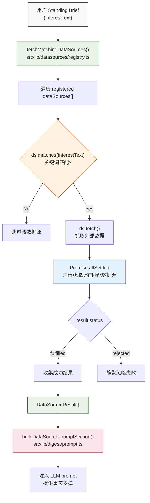

# 外部数据源

## 概述

外部数据源模块（Datasources）是一个可扩展的实时数据获取系统，根据用户 Standing Brief 中的关键词自动匹配并获取外部数据，注入到 LLM prompt 中提供事实支撑。

设计理念是"零配置匹配"——用户无需手动勾选想要的数据源，只需用自然语言描述兴趣即可。例如用户写 "关注 GitHub 热门项目和美股动态"，系统会自动匹配 GitHub Trending 和 US Stock Movers 两个数据源，抓取实时数据并注入到摘要生成的 prompt 中。

模块涉及的核心文件：

| 文件 | 职责 |
|---|---|
| `src/lib/datasources/types.ts` | TypeScript 接口定义：`DataSource`、`DataSourceResult` |
| `src/lib/datasources/registry.ts` | 数据源注册表及核心调度函数 `fetchMatchingDataSources()` |
| `src/lib/datasources/index.ts` | Barrel export，对外统一导出 |
| `src/lib/datasources/github-trending.ts` | GitHub Trending 数据源实现 |
| `src/lib/datasources/us-stock-movers.ts` | US Stock Movers 数据源实现 |
| `src/lib/digest/prompt.ts` | 消费方：`buildDataSourcePromptSection()` 将数据源结果注入 prompt |

## 架构图



## 核心逻辑

### 1. 接口定义

**文件**: `src/lib/datasources/types.ts`

```typescript
export interface DataSourceResult {
  sourceName: string;
  markdown: string;
}

export interface DataSource {
  id: string;
  name: string;
  matches(interestText: string): boolean;
  fetch(): Promise<DataSourceResult>;
}
```

`DataSource` 接口定义了数据源必须实现的四个成员：

- `id`: 数据源唯一标识符，如 `"github-trending"`、`"us-stock-movers"`
- `name`: 人类可读的显示名称，如 `"GitHub Trending"`、`"US Stock Movers"`
- `matches(interestText)`: 判断给定的兴趣文本是否需要此数据源。接收完整的 `interestText` 字符串，返回 `boolean`
- `fetch()`: 异步获取外部数据，返回 `DataSourceResult`，包含数据源名称和 markdown 格式的数据内容

`DataSourceResult` 是数据源的输出格式：

- `sourceName`: 数据来源名称，用于在 prompt 中标注数据出处
- `markdown`: 抓取到的数据，格式化为 markdown（通常是表格），直接注入 LLM prompt

这两个接口构成了整个数据源系统的契约。新增数据源只需实现 `DataSource` 接口并注册到 registry 中即可。

### 2. Registry 调度中心

**文件**: `src/lib/datasources/registry.ts:fetchMatchingDataSources()`

```typescript
const dataSources: DataSource[] = [
  createGitHubTrendingSource(),
  createUSStockMoversSource(),
];

export async function fetchMatchingDataSources(
  interestText: string,
): Promise<DataSourceResult[]> {
  const matching = dataSources.filter((ds) => ds.matches(interestText));
  if (matching.length === 0) return [];

  const results = await Promise.allSettled(matching.map((ds) => ds.fetch()));

  return results
    .filter(
      (r): r is PromiseFulfilledResult<DataSourceResult> =>
        r.status === "fulfilled",
    )
    .map((r) => r.value);
}
```

`fetchMatchingDataSources()` 是整个模块的核心调度函数，执行三步操作：

**步骤 1 -- 过滤匹配的数据源**

遍历 `dataSources` 数组，对每个数据源调用 `ds.matches(interestText)`，保留返回 `true` 的数据源。如果没有任何匹配，直接返回空数组，避免不必要的网络请求。

**步骤 2 -- 并行获取数据**

对所有匹配的数据源调用 `ds.fetch()`，使用 `Promise.allSettled()` 并行执行。`allSettled` 而非 `all` 的选择至关重要——即使某个数据源抛出异常（网络超时、API 不可用等），其他数据源的结果不受影响。

**步骤 3 -- 过滤成功结果**

遍历 `allSettled` 的结果数组，仅保留 `status === "fulfilled"` 的项，提取 `.value`（即 `DataSourceResult`）。失败的结果（`status === "rejected"`）被静默丢弃，不做日志记录，不抛异常。

注意 `dataSources` 数组是模块级常量，在 import 时通过工厂函数（`createGitHubTrendingSource()`、`createUSStockMoversSource()`）实例化。新增数据源只需在此数组中添加一项。

### 3. Barrel Export

**文件**: `src/lib/datasources/index.ts`

```typescript
export type { DataSource, DataSourceResult } from "./types";
export { createGitHubTrendingSource } from "./github-trending";
export { createUSStockMoversSource } from "./us-stock-movers";
export { fetchMatchingDataSources } from "./registry";
```

标准 barrel export 模式。消费方（如 `src/lib/digest/prompt.ts`）通过 `import { fetchMatchingDataSources } from "@/lib/datasources"` 即可访问核心函数，无需关心模块内部的文件组织结构。同时也导出了各数据源的工厂函数和类型定义，方便测试和扩展。

### 4. GitHub Trending 数据源

**文件**: `src/lib/datasources/github-trending.ts`

GitHub Trending 数据源通过爬取 GitHub Trending 页面获取每日热门仓库列表。

**触发关键词**

```typescript
const MATCH_PATTERNS = [
  /github\s*trending/i,
  /github\s*趋势/i,
  /github\s*热门/i,
  /github\s*热榜/i,
];
```

四个正则表达式覆盖中英文关键词，全部 case insensitive。`matchesGitHubTrending(interestText)` 函数使用 `MATCH_PATTERNS.some(p => p.test(interestText))` 判断，只要命中任一模式即匹配。

注意正则中使用了 `\s*` 允许 "github trending" 和 "githubtrending" 都能匹配（中间可以有零个或多个空白字符）。

**数据抓取与解析**

```typescript
const TRENDING_URL = "https://github.com/trending?since=daily";
```

通过 `fetch()` 请求 GitHub Trending 页面获取原始 HTML，然后使用 cheerio 库解析 DOM 结构：

```typescript
export function parseTrendingHtml(html: string): TrendingRepo[] {
  const $ = cheerio.load(html);
  const repos: TrendingRepo[] = [];

  $("article.Box-row").each((_, el) => {
    const $el = $(el);
    const repoLink = $el.find("h2 a");
    const href = repoLink.attr("href")?.trim() ?? "";
    const name = repoLink.text().replace(/\s+/g, " ").trim().replace(" / ", "/");
    const description = $el.find("p").first().text().trim();
    const starsEl = $el.find("span.d-inline-block.float-sm-right");
    const todayStars = starsEl.text().trim();

    if (name && href) {
      repos.push({
        name,
        url: `https://github.com${href}`,
        description: description || "—",
        todayStars: todayStars || "—",
      });
    }
  });

  return repos;
}
```

解析逻辑依赖 GitHub 的 HTML 结构：每个仓库是一个 `article.Box-row` 元素，从中提取仓库名称、链接、描述和今日 star 数。对于缺失的描述或 star 数，使用 "—" 占位。

**输出格式**

`formatTrendingMarkdown()` 将解析结果格式化为 markdown 表格：

```markdown
| # | Repository | Description | Today's Stars |
|---|-----------|-------------|---------------|
| 1 | [owner/repo](https://github.com/owner/repo) | A cool project | 1,234 stars today |
| 2 | ... | ... | ... |
```

**工厂函数**

`createGitHubTrendingSource()` 返回一个满足 `DataSource` 接口的对象，将 `matchesGitHubTrending` 赋值给 `matches`，在 `fetch` 中串联 HTTP 请求、HTML 解析和 markdown 格式化：

```typescript
export function createGitHubTrendingSource(): DataSource {
  return {
    id: "github-trending",
    name: "GitHub Trending",
    matches: matchesGitHubTrending,
    async fetch(): Promise<DataSourceResult> {
      const res = await fetch(TRENDING_URL);
      if (!res.ok) {
        throw new Error(`GitHub Trending fetch failed: ${res.status}`);
      }
      const html = await res.text();
      const repos = parseTrendingHtml(html);
      return {
        sourceName: "GitHub Trending",
        markdown: formatTrendingMarkdown(repos),
      };
    },
  };
}
```

fetch 失败时直接 `throw`，由 registry 层的 `Promise.allSettled` 兜底处理。

### 5. US Stock Movers 数据源

**文件**: `src/lib/datasources/us-stock-movers.ts`

US Stock Movers 数据源通过 Yahoo Finance screener API 获取当日涨幅和跌幅最大的美股。

**触发关键词**

```typescript
const MATCH_PATTERNS = [
  /美股/i,
  /us\s*stock/i,
  /u\.?s\.?\s*equit/i,
  /wall\s*street/i,
  /nasdaq/i,
  /s&p\s*500/i,
  /道琼斯/i,
  /纳斯达克/i,
  /标普/i,
];
```

九个正则表达式覆盖中英文关键词，包括常见的美股指数名称和金融术语。`matchesUSStocks(interestText)` 的匹配逻辑与 GitHub Trending 相同，使用 `some` + `test`。

**数据抓取**

使用 Yahoo Finance 的 screener API，分别获取 Top 5 Gainers 和 Top 5 Losers：

```typescript
const GAINERS_URL =
  "https://query1.finance.yahoo.com/v1/finance/screener/predefined/saved?formatted=false&lang=en-US&region=US&scrIds=day_gainers&count=5";
const LOSERS_URL =
  "https://query1.finance.yahoo.com/v1/finance/screener/predefined/saved?formatted=false&lang=en-US&region=US&scrIds=day_losers&count=5";
```

两个 URL 通过 `Promise.all` 并行请求（注意这里用的是 `Promise.all` 而非 `Promise.allSettled`——如果任一请求失败，整个数据源标记为失败，由上层 registry 的 `allSettled` 兜底）。

请求时设置了 `User-Agent: "Mozilla/5.0"` header，以避免被 Yahoo Finance 的反爬策略拦截：

```typescript
async function fetchQuotes(url: string): Promise<StockQuote[]> {
  const res = await fetch(url, {
    headers: { "User-Agent": "Mozilla/5.0" },
  });
  if (!res.ok) {
    throw new Error(`Yahoo Finance fetch failed: ${res.status}`);
  }
  return parseScreenerResponse(await res.json());
}
```

**响应解析**

`parseScreenerResponse()` 从 Yahoo Finance 的 JSON 响应中提取股票信息：

```typescript
export function parseScreenerResponse(json: unknown): StockQuote[] {
  const data = json as {
    finance?: {
      result?: { quotes?: StockQuote[] }[];
    };
  };

  const quotes = data?.finance?.result?.[0]?.quotes;
  if (!Array.isArray(quotes)) return [];

  return quotes
    .filter((q) => q.symbol && typeof q.regularMarketChangePercent === "number")
    .map((q) => ({
      symbol: q.symbol,
      shortName: q.shortName ?? q.symbol,
      regularMarketPrice: q.regularMarketPrice ?? 0,
      regularMarketChange: q.regularMarketChange ?? 0,
      regularMarketChangePercent: q.regularMarketChangePercent ?? 0,
    }));
}
```

使用 optional chaining 安全地导航 JSON 结构 `data?.finance?.result?.[0]?.quotes`。过滤掉缺少 `symbol` 或 `regularMarketChangePercent` 的无效记录，对缺失的 `shortName`、`regularMarketPrice`、`regularMarketChange` 提供默认值。

**`{{FILL}}` 占位符机制**

`formatMoversMarkdown()` 生成的 markdown 表格包含两列使用 `{{FILL}}` 占位符：

```markdown
### Top Gainers

| # | Name | Business | Price | Change | Reason |
|---|------|----------|-------|--------|--------|
| 1 | Apple Inc (AAPL) | {{FILL}} | $175.30 | +2.50 (+1.45%) | {{FILL}} |

### Top Losers

| # | Name | Business | Price | Change | Reason |
|---|------|----------|-------|--------|--------|
| 1 | Tesla Inc (TSLA) | {{FILL}} | $245.20 | -5.30 (-2.12%) | {{FILL}} |

**Instructions:** Keep this table format in your output. Replace every {{FILL}} in the Business
column with the company's industry or main business (1-5 words), and every {{FILL}} in the Reason
column with a brief reason for today's move (search for the cause). Do NOT expand rows into
separate sections.
```

`{{FILL}}` 是一个有意的设计——数据源提供了实时的股价和涨跌幅数据，但 Business（公司主营业务）和 Reason（涨跌原因）需要 LLM 基于自身知识补充。这样的混合方式使得输出既有实时数据支撑，又有智能分析。表格末尾的 Instructions 段落指导 LLM 如何处理 `{{FILL}}` 占位符，并明确要求保持表格格式、不要将行展开为独立章节。

### 6. Prompt 注入

**文件**: `src/lib/digest/prompt.ts:buildDataSourcePromptSection()`

数据源结果通过 `buildDataSourcePromptSection()` 注入到 LLM prompt 中：

```typescript
function buildDataSourcePromptSection(contexts: DataSourceResult[]): string {
  if (contexts.length === 0) return "";

  const sections = contexts
    .filter((c) => c.markdown)
    .map((c) => `### ${c.sourceName}\n\n${c.markdown}`);

  if (sections.length === 0) return "";

  return `
## Pre-fetched Real Data

The following real data has been pre-fetched for you. You MUST use this data as the primary
source of truth. Do NOT fabricate or hallucinate entries — only reference items that appear
in the data below.

${sections.join("\n\n")}
`;
}
```

关键行为：

- 过滤掉 `markdown` 为空的结果（例如 GitHub Trending 解析到 0 个仓库时 `formatTrendingMarkdown()` 返回空字符串）
- 每个数据源结果用 `### sourceName` 作为子标题分隔
- prompt 中包含明确的反幻觉指令："Do NOT fabricate or hallucinate entries"，要求 LLM 只引用数据中实际存在的条目

`buildBasePrompt()` 函数接收 `dataSourceContexts` 参数，调用 `buildDataSourcePromptSection()` 将数据注入到整体 prompt 中。消费方通过 `fetchMatchingDataSources(interestText)` 获取数据，再传给 `buildBasePrompt()` 完成 prompt 构建。

### 7. 如何扩展新数据源

添加新数据源只需三步：

**步骤 1 -- 创建实现文件**

在 `src/lib/datasources/` 下创建新文件，例如 `my-source.ts`：

```typescript
import type { DataSource, DataSourceResult } from "./types";

const MATCH_PATTERNS = [
  /my[\s-]*keyword/i,
  /我的关键词/i,
];

function matchesMySource(interestText: string): boolean {
  return MATCH_PATTERNS.some((p) => p.test(interestText));
}

export function createMySource(): DataSource {
  return {
    id: "my-source",
    name: "My Source",
    matches: matchesMySource,
    async fetch(): Promise<DataSourceResult> {
      // 抓取外部数据...
      return {
        sourceName: "My Source",
        markdown: "| Column A | Column B |\n|---|---|\n| data | data |",
      };
    },
  };
}
```

**步骤 2 -- 注册到 registry**

在 `src/lib/datasources/registry.ts` 中导入并添加到 `dataSources` 数组：

```typescript
import { createMySource } from "./my-source";

const dataSources: DataSource[] = [
  createGitHubTrendingSource(),
  createUSStockMoversSource(),
  createMySource(),  // 新增
];
```

**步骤 3 -- 导出（可选）**

如果需要让外部直接访问工厂函数（例如单元测试），在 `src/lib/datasources/index.ts` 中添加导出：

```typescript
export { createMySource } from "./my-source";
```

不需要修改 `fetchMatchingDataSources()` 函数本身——它会自动遍历 `dataSources` 数组中的所有数据源。也不需要修改 prompt 构建逻辑——`buildDataSourcePromptSection()` 会自动处理任意数量的 `DataSourceResult`。

## 关键设计决策

### matches 自动匹配，无需手动配置

每个数据源通过 `matches(interestText)` 方法自行决定是否与用户的兴趣匹配。用户只需用自然语言描述兴趣，系统根据正则表达式自动选择相关的数据源。这避免了让用户手动勾选数据源的交互复杂性，也使得新增数据源对用户完全透明——只要用户的 Standing Brief 包含匹配的关键词，新数据源就会自动生效。

### markdown 输出格式

所有数据源统一输出 markdown 格式的数据。markdown 是 LLM 原生友好的格式——表格、列表、链接都能被 LLM 正确理解和引用。相比 JSON，markdown 省去了格式转换步骤；相比纯文本，markdown 的表格结构更有利于 LLM 提取和引用特定数据项。

### Promise.allSettled + 静默忽略失败

使用 `Promise.allSettled` 而非 `Promise.all` 确保单个数据源的失败不会影响其他数据源的结果，也不会中断整体摘要生成流程。失败的数据源被静默忽略（不做日志记录），这是有意的简化——外部数据源本质上是"锦上添花"，即使全部失败，LLM 仍然可以基于自身知识生成摘要。

### `{{FILL}}` 占位符策略

US Stock Movers 数据源在 markdown 表格中使用 `{{FILL}}` 占位符，让 LLM 在最终输出时补充公司主营业务和涨跌原因。这种"数据+分析"的混合方式比纯数据展示更有价值——实时数据提供了准确的价格和涨跌幅，而 LLM 补充了需要知识推理的业务描述和原因分析。表格末尾附带的 Instructions 段落确保 LLM 保持表格格式、不随意展开行。

### 工厂函数模式

每个数据源通过工厂函数（如 `createGitHubTrendingSource()`）创建，而非直接导出对象。这提供了未来的灵活性——如果数据源需要接收配置参数（如 API Key、请求超时时间等），只需修改工厂函数的参数签名即可，不需要改变 registry 的架构。

### barrel export 封装内部结构

`src/lib/datasources/index.ts` 作为唯一的对外接口，消费方通过 `import from "@/lib/datasources"` 访问所有公开 API。内部文件的拆分和重组不会影响消费方的 import 语句。

## 注意事项

1. **GitHub Trending 依赖 HTML 结构**。`parseTrendingHtml()` 通过 CSS 选择器（`article.Box-row`、`h2 a`、`span.d-inline-block.float-sm-right` 等）解析 GitHub 页面。GitHub 改版前端结构时，这些选择器可能会失效，需要及时更新解析逻辑。建议在 CI 中增加集成测试，定期验证解析器的可用性。

2. **Yahoo Finance API 非公开接口**。`query1.finance.yahoo.com` 是 Yahoo Finance 的内部 API，没有官方文档，不提供 SLA 保证。API 的 URL、响应格式、访问限制可能随时变更。当前代码通过设置 `User-Agent` header 绕过基础的反爬检测，但这不是稳定的长期方案。

3. **新增数据源时需考虑中英文关键词**。Newsi 的用户群体可能使用中文或英文描述兴趣。现有的两个数据源都同时支持中英文关键词（如 "github trending" 和 "github 热榜"）。新增数据源时应遵循同样的实践，确保中文和英文描述都能正确匹配。

4. **数据源 fetch 超时或网络错误会被 `allSettled` 捕获**。在 `fetchMatchingDataSources()` 中，任何数据源的 `fetch()` 抛出的异常都会被 `Promise.allSettled` 包装为 `rejected` 状态，不会中断其他数据源的获取，也不会影响整体摘要生成。但需注意的是，当前没有显式的超时控制——如果某个外部 API 长时间不响应，会阻塞整体流程直到 runtime 的默认超时生效。

5. **反幻觉指令**。`buildDataSourcePromptSection()` 在注入数据时包含明确的指令："Do NOT fabricate or hallucinate entries — only reference items that appear in the data below"。这要求 LLM 只引用实际存在于数据中的条目，防止 LLM 凭空编造 GitHub 仓库名或股票代码。

6. **空结果处理**。`formatTrendingMarkdown()` 和 `formatMoversMarkdown()` 在输入数组为空时返回空字符串。`buildDataSourcePromptSection()` 会过滤掉 `markdown` 为空的结果，因此即使某个数据源成功执行但未获取到任何数据（例如 GitHub Trending 页面结构变化导致解析到 0 个仓库），也不会在 prompt 中产生空白的数据段落。

7. **US Stock Movers 内部使用 `Promise.all`**。`createUSStockMoversSource()` 的 `fetch` 方法内部使用 `Promise.all` 并行请求 Gainers 和 Losers 两个 URL。这意味着如果两个请求中的任一个失败，整个数据源会标记为失败。这是合理的——Gainers 和 Losers 应该作为一个整体呈现，只展示一半数据的意义不大。失败后由 registry 层的 `Promise.allSettled` 兜底，不影响其他数据源。

8. **`parseScreenerResponse()` 的防御性解析**。解析函数对 Yahoo Finance 的 JSON 响应进行了充分的防御——使用 optional chaining 导航嵌套结构，过滤缺少关键字段的记录，对缺失字段提供默认值（`?? 0`、`?? q.symbol`）。这确保了即使 API 返回格式部分变更，解析器也能优雅降级而非直接崩溃。
