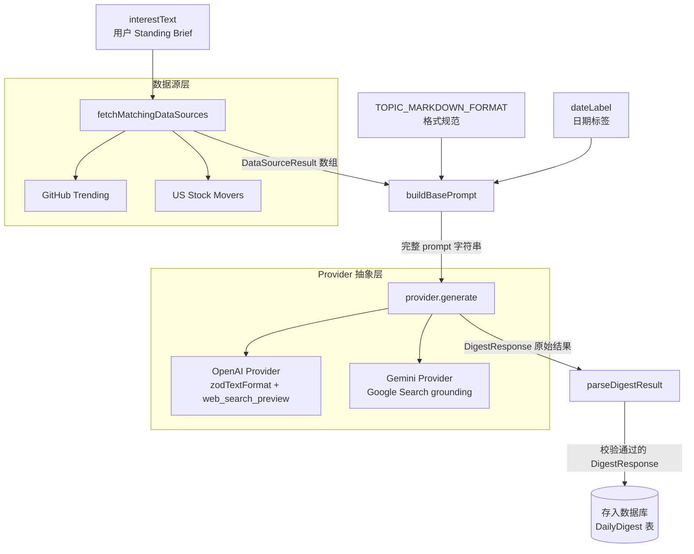

# 摘要生成

## 概述

摘要生成模块是 Newsi 的核心引擎，负责将用户的 Standing Brief（长期关注的兴趣描述）转化为结构化的每日智能简报。整个模块围绕一条清晰的数据管道构建：接收用户兴趣文本，匹配预获取数据源，构建 prompt，调用 LLM 生成结构化 JSON，校验并存入数据库。

模块的主要源码位于 `src/lib/digest/` 目录下，包含以下核心文件：

| 文件 | 职责 |
|------|------|
| `src/lib/digest/service.ts` | 生成入口、批量调度循环、数据库读写 |
| `src/lib/digest/provider.ts` | LLM Provider 抽象层（OpenAI / Gemini） |
| `src/lib/digest/prompt.ts` | Prompt 构建、Topic Markdown 格式规范 |
| `src/lib/digest/schema.ts` | Zod 响应 schema 定义 |
| `src/lib/digest/view-state.ts` | UI 视图状态推导逻辑 |
| `src/lib/digest/format.ts` | 日期格式化工具函数 |

该模块的设计核心思想是**关注点分离**：LLM 调用逻辑、Prompt 工程、响应校验、视图状态各自独立，通过明确的接口协作。这使得切换 LLM 供应商、调整 prompt 策略、修改 UI 状态机时，不会产生跨模块的耦合。

---

## 架构图



整条管道的数据流可以概括为：

1. 用户的 `interestText` 同时传递给数据源匹配和 prompt 构建
2. `fetchMatchingDataSources()` 根据兴趣文本匹配并预获取外部数据（如 GitHub Trending、US Stock Movers）
3. `buildBasePrompt()` 将日期、兴趣文本、数据源上下文、Topic Markdown 格式规范组装成完整 prompt
4. `provider.generate()` 调用具体的 LLM（OpenAI 或 Gemini）生成结构化响应
5. `parseDigestResult()` 用 Zod schema 做最终校验，确保输出符合 `DigestResponse` 类型
6. 校验通过的结果写入 `DailyDigest` 数据库表

---

## 核心逻辑

### 1. generateDigest() 入口函数

**文件**: `src/lib/digest/service.ts:generateDigest()`

`generateDigest()` 是摘要生成的核心入口函数，接收三个参数：

```typescript
export async function generateDigest({
  provider = createDigestProvider(),
  dateLabel,
  interestText,
}: {
  provider?: DigestProvider;
  dateLabel: string;
  interestText: string;
}) {
  const dataSourceContexts = await fetchMatchingDataSources(interestText);
  const prompt = buildBasePrompt({ dateLabel, interestText, dataSourceContexts });
  const raw = await provider.generate({ prompt });
  return parseDigestResult(raw);
}
```

函数的执行步骤非常简洁：

1. **获取数据源上下文**：调用 `fetchMatchingDataSources(interestText)` 获取与用户兴趣匹配的预获取数据。该函数位于 `src/lib/datasources/registry.ts`，内部维护一个 `DataSource[]` 注册表（目前包含 GitHub Trending 和 US Stock Movers 两个数据源），通过 `ds.matches(interestText)` 判断是否匹配，然后并发调用 `ds.fetch()` 获取数据。使用 `Promise.allSettled` 确保单个数据源失败不会阻塞整体流程。

2. **构建 prompt**：调用 `buildBasePrompt()` 将日期标签、兴趣文本和数据源上下文组装成完整的 system prompt。

3. **调用 LLM**：通过 `provider.generate({ prompt })` 发送 prompt 给 LLM，获取原始响应。`provider` 参数默认通过 `createDigestProvider()` 创建，根据环境变量自动选择 OpenAI 或 Gemini。

4. **校验结果**：调用 `parseDigestResult(raw)` 用 Zod schema 验证 LLM 的输出，确保类型安全。

除了 `generateDigest()` 之外，`service.ts` 还包含几个重要的辅助函数：

- **`runDigestGenerationCycle()`**：批量调度循环，遍历所有 `status === "active"` 的 InterestProfile，为每个用户生成当日 digest。该函数会检查 `hasBeijingDailyRunPassed(now)` 确认是否已过北京时间 07:00 的批次触发时间，还会检查 `firstEligibleDigestDayKey` 确保用户已达到首次生成资格。生成前将 digest 状态设为 `"generating"`，成功后更新为 `"ready"` 并写入标题、摘要、内容、阅读时间、Provider 信息；失败时更新为 `"failed"` 并记录 `retryCount` 和 `failureReason`。
- **`MAX_DIGEST_RETRIES`**：常量值为 `3`，digest 生成失败后最多重试 3 次，超过后不再尝试。
- **`parseStoredDigestContent()`**：从数据库读取已存储的 `contentJson` 时，用 `safeParse` 做安全校验。
- **`getTodayDigest()` / `getDigestByDayKey()` / `listArchivedDigests()`**：数据库读取函数，分别获取当日 digest、指定日期 digest、归档列表。

`DigestCycleResult` 接口记录批量调度的运行结果：

```typescript
export interface DigestCycleResult {
  processed: number;  // 本次实际处理的用户数
  ready: number;      // 成功生成的数量
  failed: number;     // 生成失败的数量
  skipped: number;    // 跳过的数量（已完成、正在生成、或超过重试上限）
}
```

---

### 2. DigestProvider 接口

**文件**: `src/lib/digest/provider.ts:DigestProvider`

`DigestProvider` 是 LLM 调用的核心抽象接口：

```typescript
export interface DigestProvider {
  name?: string;
  model?: string;
  generate(input: { prompt: string }): Promise<DigestResponse>;
}
```

三个字段的职责：
- `name`：Provider 标识（`"openai"` 或 `"gemini"`），存入数据库的 `providerName` 字段用于追踪
- `model`：具体使用的模型名称（如 `"gpt-5.4"`、`"gemini-2.5-flash"`），存入 `providerModel`
- `generate()`：核心方法，接收完整 prompt，返回 `DigestResponse`

工厂函数 `createDigestProvider()` 负责根据环境变量选择具体实现：

```typescript
export function createDigestProvider(): DigestProvider {
  return resolveProviderName() === "gemini"
    ? createGeminiDigestProvider()
    : createOpenAIDigestProvider();
}
```

`resolveProviderName()` 读取 `LLM_PROVIDER` 环境变量，当值为 `"gemini"`（不区分大小写）时返回 Gemini，否则默认返回 OpenAI。这是一个简洁的**策略模式**实现：调用方无需关心底层使用哪个 LLM，只需通过统一接口 `generate()` 获取结果。

---

### 3. OpenAI Provider

**文件**: `src/lib/digest/provider.ts:createOpenAIDigestProvider()`

OpenAI Provider 是当前的默认实现，利用 OpenAI 的 Responses API 和 Structured Outputs 能力：

```typescript
export function createOpenAIDigestProvider({
  apiKey = process.env.LLM_API_KEY,
  model = resolveOpenAIModel(),
  client,
}: {
  apiKey?: string;
  model?: string;
  client?: OpenAIResponsesClient;
} = {}): DigestProvider
```

关键技术细节：

**Structured Outputs**：使用 `zodTextFormat(openAIDigestResponseSchema, "daily_digest")` 将 Zod schema 传递给 OpenAI，让模型直接按 schema 结构输出 JSON。这比让模型自由输出再解析 JSON 要可靠得多——OpenAI 的 structured outputs 从模型层面保证输出严格符合 schema。

**Web Search**：在 `tools` 配置中添加了 `web_search_preview` 工具（`search_context_size: "medium"`），允许 LLM 在生成过程中主动搜索互联网上的实时信息。这是 digest 内容时效性的关键保障。

**默认模型**：`DEFAULT_OPENAI_MODEL` 为 `"gpt-5.4"`，可通过 `LLM_MODEL` 环境变量覆盖。

**Prompt 增强**：在 `buildBasePrompt()` 的基础上追加了 `## Output\nReturn structured JSON only.` 和 `TOPIC_MARKDOWN_FORMAT`。

**响应处理**：OpenAI 的 `responses.parse()` 直接返回 `output_parsed`（已经是类型化对象），经过 `finalizeDigest()` 做最终 Zod 校验后返回。如果 `output_parsed` 为 `null`，抛出明确的错误信息。

**依赖注入**：`client` 参数允许在测试中注入 mock 的 OpenAI client，无需调用真实 API。

---

### 4. Gemini Provider

**文件**: `src/lib/digest/provider.ts:createGeminiDigestProvider()`

Gemini Provider 使用 Google GenAI SDK，实现相同的 `DigestProvider` 接口，但响应处理逻辑更复杂：

```typescript
export function createGeminiDigestProvider({
  apiKey = process.env.GEMINI_API_KEY ?? process.env.LLM_API_KEY,
  model = resolveGeminiModel(),
  client,
}: {
  apiKey?: string;
  model?: string;
  client?: GeminiGenerateContentClient;
} = {}): DigestProvider
```

**API Key 回退**：优先使用 `GEMINI_API_KEY`，如果未设置则回退到 `LLM_API_KEY`。这允许在同时配置了两个 Provider 的环境中使用不同的密钥。

**Google Search Grounding**：通过 `config.tools: [{ googleSearch: {} }]` 启用 Google Search grounding，让 Gemini 模型可以搜索 Google 获取实时信息——功能上等价于 OpenAI Provider 的 `web_search_preview`。

**默认模型**：`DEFAULT_GEMINI_MODEL` 为 `"gemini-2.5-flash"`，可通过 `LLM_MODEL` 环境变量覆盖。

**Prompt 增强**：`buildGeminiDigestPrompt()` 在基础 prompt 后追加了额外指令，明确要求 Gemini 输出纯 JSON（不包裹 markdown fences），并附带 `TOPIC_MARKDOWN_FORMAT` 格式规范。

**响应处理三阶段**——这是 Gemini Provider 最关键的部分，因为 Gemini 不支持原生 structured output，必须从文本中提取 JSON：

**阶段一：extractGeminiJsonCandidate()**

从 Gemini 返回的文本中提取 JSON 对象。该函数实现了多重 fallback 策略：

1. 首先尝试匹配 ` ```json ... ``` ` 或 ` ``` ... ``` ` 格式的 fenced code block
2. 如果找到 fenced block，使用其内容；否则使用完整响应文本
3. 在候选文本中找到第一个 `{` 的位置
4. 从该位置开始用一个手写的括号深度追踪器（考虑字符串转义和嵌套）精确提取出完整的 JSON 对象
5. 如果找不到 `{`，直接返回候选文本（后续 `JSON.parse` 会抛出错误，被外层捕获）

这个实现比简单的正则匹配更健壮，因为它正确处理了 JSON 字符串中的转义字符和嵌套大括号。

**阶段二：normalizeGeminiDigest()**

Gemini 模型返回的字段名可能与 schema 不完全一致，`normalizeGeminiDigest()` 负责灵活解析：

- `intro` 字段：同时接受 `intro` 和 `introduction` 两种命名
- `readingTime` 字段：如果模型未返回有效的 `readingTime`（或返回的值不是 number 类型），调用 `estimateReadingTimeFromDigest()` 自动估算
- `topics` 数组：逐个解析验证每个 topic 的 `topic` 和 `markdown` 字段

**阶段三：estimateReadingTimeFromDigest()**

当 Gemini 未返回有效的阅读时间时，基于内容长度估算：

```typescript
const words = text.trim().split(/\s+/).filter(Boolean).length;
return Math.min(20, Math.max(3, Math.round(words / 180) || 3));
```

计算逻辑：将 intro 和所有 topic 的文本合并，按空格分词，以 180 WPM（words per minute）为基准计算阅读时间，最终 clamp 到 3-20 分钟区间。如果 `Math.round(words / 180)` 结果为 0（内容极短），则兜底返回 3 分钟。

---

### 5. Prompt 设计

**文件**: `src/lib/digest/prompt.ts`

Prompt 是 LLM 输出质量的核心决定因素。模块将 prompt 构建逻辑独立到 `prompt.ts` 中，包含两个导出函数和一个关键常量。

#### buildBasePrompt()

`src/lib/digest/prompt.ts:buildBasePrompt()` 是主要的 prompt 构建函数，签名为：

```typescript
export function buildBasePrompt({
  dateLabel,
  interestText,
  dataSourceContexts = [],
}: {
  dateLabel: string;
  interestText: string;
  dataSourceContexts?: DataSourceResult[];
})
```

构建的 prompt 包含以下层次：

1. **角色设定**：`"You are an expert research analyst generating a personal daily intelligence briefing."` —— 将 LLM 定位为专业的情报分析师，而非普通的新闻摘要机器人。
2. **日期标签**：`Date: ${dateLabel}` —— 确保 LLM 知道当天日期，搜索最新信息。
3. **Standing Brief**：`Standing brief: ${interestText}` —— 用户的兴趣描述，是整个 digest 的方向指引。
4. **数据源上下文**（条件性）：如果 `dataSourceContexts` 非空，通过 `buildDataSourcePromptSection()` 注入预获取的真实数据。
5. **任务描述**：要求基于 standing brief 搜索最新信息，产出 data-rich digest。
6. **内容质量要求**：六条明确的质量标准——具体（真实名称、数字）、分析性（解释因果）、数据驱动（量化数据）、Markdown 格式化、来源引用、领域专家视角。
7. **深度指南**：针对金融、科技、通用主题给出不同的深度要求。
8. **语言匹配**：`"Respond in the same language as the standing brief"` —— 如果用户用中文写 standing brief，LLM 输出也必须是中文。

#### buildDataSourcePromptSection()

`src/lib/digest/prompt.ts:buildDataSourcePromptSection()` 是内部 helper 函数，将 `DataSourceResult[]` 格式化为 prompt 段落：

```
## Pre-fetched Real Data

The following real data has been pre-fetched for you. You MUST use this data
as the primary source of truth. Do NOT fabricate or hallucinate entries —
only reference items that appear in the data below.

### GitHub Trending
[markdown content]

### US Stock Movers
[markdown content]
```

关键点在于反幻觉指令：明确告诉 LLM "Do NOT fabricate or hallucinate entries"，确保当预获取数据可用时，LLM 基于真实数据生成内容，而非凭空编造。

#### TOPIC_MARKDOWN_FORMAT

`src/lib/digest/prompt.ts:TOPIC_MARKDOWN_FORMAT` 是一段长常量字符串，定义了两种 topic markdown 格式规范。这段规范同时附加到 OpenAI 和 Gemini 的 prompt 中。

**Format A: Event Briefing**（事件简报）——默认格式，适用于新闻、市场波动、政策变化、产品发布等：

结构为：开头概述段落（无标题）-> 最多 7 个事件块（以 `---` 分隔）-> 每个事件包含 `#### Event Title`、事实描述、`> **Why it matters:**` 分析、`*Sources:*` 来源引用 -> 结尾 `> **Today's takeaway:**` 总评。

**Format B: Leaderboard**（排行榜）——适用于排名、趋势列表、Top-N 类内容：

结构为：开头概述段落 -> Markdown 表格（# | Name | Description | Metric）-> 0-2 个高亮 `####` 块 -> 结尾 `> **Today's takeaway:**` 总评。

两个关键设计点：
- **LLM 自主选择格式**：prompt 中不要求 LLM 显式声明选择了哪种格式，而是根据 topic 内容的性质自行判断。这减少了额外的 prompt 指令开销，同时利用了 LLM 的语义理解能力。
- **国际化标签**：prompt 规定 "Why it matters" 和 "Today's takeaway" 等标签必须与 standing brief 的语言一致（中文 brief 需使用 "为什么重要：" 和 "今日总评："）。

---

### 6. DigestResponse Schema

**文件**: `src/lib/digest/schema.ts`

响应 schema 使用 Zod 定义，既用于 OpenAI 的 structured outputs，也用于最终的结果校验：

```typescript
const digestTopicSchema = z.object({
  topic: z.string().min(1),
  markdown: z.string().min(1),
});

export const digestResponseSchema = z.object({
  title: z.string().min(1),
  intro: z.string().min(1).optional(),
  readingTime: z.number().int().min(3).max(20),
  topics: z.array(digestTopicSchema).min(1).max(3),
});

export type DigestResponse = z.infer<typeof digestResponseSchema>;
```

各字段说明：

| 字段 | 类型 | 约束 | 说明 |
|------|------|------|------|
| `title` | `string` | 最少 1 字符 | digest 标题 |
| `intro` | `string?` | 可选，最少 1 字符 | 简短导语 |
| `readingTime` | `number` | 整数，3-20 | 预计阅读时间（分钟） |
| `topics` | `DigestTopic[]` | 1-3 个元素 | 话题数组 |
| `topics[].topic` | `string` | 最少 1 字符 | 话题标题 |
| `topics[].markdown` | `string` | 最少 1 字符 | 话题内容（Markdown 格式） |

值得注意的是，`provider.ts` 中 OpenAI 专用的 `openAIDigestResponseSchema` 与公共的 `digestResponseSchema` 有一个细微差异：前者的 `intro` 是必填的（`z.string().min(1)`），而后者的 `intro` 是可选的（`.optional()`）。这是因为 OpenAI 的 structured outputs 在必填字段时表现更稳定，而 Gemini 可能不返回 intro，所以公共 schema 将其设为可选。最终 `parseDigestResult()` 使用公共的 `digestResponseSchema`，两条路径都能通过校验。

---

### 7. View State 视图状态

**文件**: `src/lib/digest/view-state.ts`

View State 模块将 UI 层的状态决策逻辑从页面组件中解耦出来，提供纯函数式的状态推导。

#### TodayDigestState 类型

定义了 6 种可能的状态：

```typescript
export type TodayDigestState =
  | "unconfigured"                 // 用户尚未创建 InterestProfile
  | "pending_preview_confirmation" // profile 处于 pending_preview 状态，等待用户确认
  | "scheduled"                    // 有 profile 但当日尚无 digest 记录
  | "generating"                   // digest 正在生成中
  | "failed"                       // digest 生成失败
  | "ready";                       // digest 已就绪，可以展示
```

#### getTodayDigestState()

`src/lib/digest/view-state.ts:getTodayDigestState()` 根据三个输入推导出当前状态：

```typescript
export function getTodayDigestState({
  hasInterestProfile,
  profileStatus,
  digest,
}: {
  hasInterestProfile: boolean;
  profileStatus?: "pending_preview" | "active" | null;
  digest: { status: ... } | null;
}): TodayDigestState
```

推导逻辑是一个简洁的优先级链：

1. 如果 `hasInterestProfile === false` -> `"unconfigured"`
2. 如果 `profileStatus === "pending_preview"` -> `"pending_preview_confirmation"`
3. 如果 `digest === null`（当日无记录）-> `"scheduled"`
4. 否则直接返回 `digest.status`（`"generating"` / `"failed"` / `"ready"`）

这个函数的设计使得 UI 组件只需调用一次即可获取当前页面应展示的状态，无需自行组合多个条件判断。

#### 辅助文案函数

- **`formatScheduledDigestMessage()`**：根据 `firstEligibleDigestDayKey` 生成调度文案。如果有首次资格日期，显示 `"Your first digest is scheduled for [date] after the Beijing 07:00 run."`；否则显示通用的 `"Your next digest will appear after the Beijing 07:00 run."`。
- **`formatFailedDigestMessage()`**：返回固定的失败文案，告知用户 digest 在北京早间批次中失败，下次批次将在次日 07:00 运行。

---

### 8. Date 工具函数

**文件**: `src/lib/digest/format.ts`

提供两个日期格式化函数，统一 digest 的日期展示风格：

#### formatDigestDate()

`src/lib/digest/format.ts:formatDigestDate()` 将数据库中存储的 `YYYY-MM-DD` 格式日期键转换为大写英文日期：

```typescript
export function formatDigestDate(dayKey: string): string {
  const [year, month, day] = dayKey.split("-");
  const date = new Date(Number(year), Number(month) - 1, Number(day));
  return date
    .toLocaleDateString("en-US", {
      year: "numeric",
      month: "long",
      day: "numeric",
    })
    .toUpperCase();
}
```

示例：`"2023-10-24"` -> `"OCTOBER 24, 2023"`。

注意实现中手动解析日期字符串为 `new Date(year, month - 1, day)` 而非使用 `new Date("2023-10-24")`，避免了时区偏移导致的 off-by-one 日期错误（UTC 解析在某些时区会偏移一天）。

#### formatTodayDate()

`src/lib/digest/format.ts:formatTodayDate()` 获取当前日期并格式化为大写形式，支持传入 `timezone` 参数（默认 `"UTC"`）：

```typescript
export function formatTodayDate(timezone?: string): string {
  const now = new Date();
  return now
    .toLocaleDateString("en-US", {
      year: "numeric",
      month: "long",
      day: "numeric",
      timeZone: timezone ?? "UTC",
    })
    .toUpperCase();
}
```

---

## 关键设计决策

### Provider 抽象：一个接口统一两条路径

`DigestProvider` 接口的设计遵循开闭原则：对扩展开放（新增 Provider 只需实现 `generate()` 方法），对修改关闭（调用方代码无需改动）。`createDigestProvider()` 作为工厂函数通过环境变量选择实现，使得在不同部署环境中切换 LLM 供应商变得极为简单。

每个 Provider 工厂函数都接受 `client` 参数用于依赖注入，这使得单元测试可以注入 mock client 而无需真实调用 LLM API。Provider 的 `name` 和 `model` 字段在 digest 生成成功后写入数据库，提供完整的溯源信息。

### OpenAI vs Gemini：两条截然不同的响应处理路径

两个 Provider 在 prompt 发送和响应处理上存在显著差异：

- **OpenAI**：使用 `zodTextFormat` 将 Zod schema 直接传递给 API，模型从底层保证输出符合 schema。响应的 `output_parsed` 直接是类型化对象，处理链路短且可靠。
- **Gemini**：不支持原生 structured output，需要在 prompt 中用自然语言描述 JSON 格式要求，然后从模型返回的文本中提取 JSON。这需要 `extractGeminiJsonCandidate()`（括号深度追踪器）+ `normalizeGeminiDigest()`（字段名容错）+ `estimateReadingTimeFromDigest()`（缺失字段补偿）三重处理。

这种差异直接影响了可靠性：OpenAI 路径几乎不会出现格式错误，而 Gemini 路径需要更多的容错逻辑。

### 限制 1-3 topics

Schema 强制要求 `topics` 数组包含 1-3 个元素。这是经过深思熟虑的 UX 决策：每日简报应当聚焦而非面面俱到。1 个 topic 是最低保证（总有东西可说），3 个 topic 是上限（避免信息过载）。这也让前端的 digest 展示组件可以基于固定范围做 UI 布局优化。

### readingTime 3-20 分钟

阅读时间被 clamp 到 3-20 分钟范围内。下限 3 分钟确保即使内容较短，也不会显示不合理的 "1 分钟阅读"（一则有内容的简报至少需要几分钟消化）。上限 20 分钟避免过长的 digest 让用户望而生畏——如果内容超过 20 分钟阅读量，说明需要在 prompt 层面控制输出长度，而非简单报告一个大数字。

### View State 独立模块

将 UI 状态推导逻辑从 React 组件中抽离到 `view-state.ts` 有多重好处：
- **可测试性**：纯函数无副作用，单元测试只需传入参数断言返回值
- **可复用性**：不同页面/组件可以共享同一套状态推导逻辑
- **关注点分离**：组件只负责根据状态渲染 UI，不负责判断当前处于什么状态

### 数据源的弹性获取

`fetchMatchingDataSources()` 使用 `Promise.allSettled`（而非 `Promise.all`）获取数据源数据。这意味着即使某个数据源 API 超时或报错，其他数据源的结果仍然可用，digest 生成不会因为单一数据源的故障而完全失败。在 `buildDataSourcePromptSection()` 中，只有 `c.markdown` 非空的数据源才会被注入 prompt，进一步增强了容错性。

---

## 注意事项

### Gemini JSON 提取的不稳定性

`extractGeminiJsonCandidate()` 虽然实现了多重 fallback，但 Gemini 模型返回的文本格式仍可能超出预期。常见问题包括：
- 模型在 JSON 前后添加解释性文本
- 模型使用 ` ```json ` fence 包裹输出（尽管 prompt 明确要求不要这样做）
- 模型返回的字段名不一致（`introduction` vs `intro`，`reading_time` vs `readingTime`）

`normalizeGeminiDigest()` 对已知的字段名变体做了容错处理，但如果模型返回全新的变体（如 `summary` 代替 `intro`），仍然会导致解析失败。在遇到 Gemini 相关的生产问题时，应首先检查模型返回的原始文本。

### 环境变量配置

| 环境变量 | 作用 | 默认值 |
|----------|------|--------|
| `LLM_PROVIDER` | 选择 Provider | `"openai"`（非 `"gemini"` 时默认 OpenAI） |
| `LLM_MODEL` | 覆盖默认模型 | OpenAI: `"gpt-5.4"` / Gemini: `"gemini-2.5-flash"` |
| `LLM_API_KEY` | OpenAI API Key | 无（必须配置） |
| `GEMINI_API_KEY` | Gemini 专用 API Key | 回退到 `LLM_API_KEY` |

### 批次调度的时区依赖

`runDigestGenerationCycle()` 依赖 `hasBeijingDailyRunPassed(now)` 和 `getBeijingDigestDayKey(now)` 两个时区函数（位于 `src/lib/timezone.ts`）。所有 digest 的调度和日期键都基于北京时间（Asia/Shanghai, UTC+8），批次在每日 07:00 北京时间触发。如果需要修改调度时间或支持多时区，需要同时修改 timezone 模块和 digest service。

### parseDigestResult() 的双重校验角色

`parseDigestResult()` 在整个管道中扮演最终守门人的角色。即使 OpenAI 的 structured outputs 理论上保证了格式正确，`parseDigestResult()` 仍然会做 Zod 校验。这是**防御性编程**的体现——不信任外部依赖的保证，始终在系统边界处做独立校验。如果 LLM 返回的数据通过了 Provider 内部的处理但不符合公共 schema，`parseDigestResult()` 会抛出 `ZodError`，被 `runDigestGenerationCycle()` 的 catch 块捕获，将 digest 标记为 `"failed"`。

### Format A/B 的选择完全由 LLM 决定

`TOPIC_MARKDOWN_FORMAT` 提供了两种格式的详细规范和示例，但没有任何逻辑强制 LLM 选择哪种格式。格式选择完全依赖 LLM 的语义理解——根据 topic 的内容性质自行判断。这意味着同一个 digest 中的不同 topics 可能使用不同的格式（一个用 Event Briefing，另一个用 Leaderboard）。这种灵活性是有意为之的设计，但也意味着前端渲染组件需要能够处理两种格式的 markdown 内容。

### 重试机制

生成失败的 digest 会在下次 `runDigestGenerationCycle()` 执行时自动重试，但有两个保护机制：
- `MAX_DIGEST_RETRIES = 3`：失败超过 3 次后不再重试，digest 保持 `"failed"` 状态
- 已处于 `"generating"` 状态的 digest 会被跳过，避免并发生成同一条 digest

`failureReason` 字段记录了最后一次失败的错误信息，通过 `getErrorMessage()` 提取——如果 error 是 `Error` 实例则取 `message`，否则返回通用文案 `"Digest generation failed."`。
