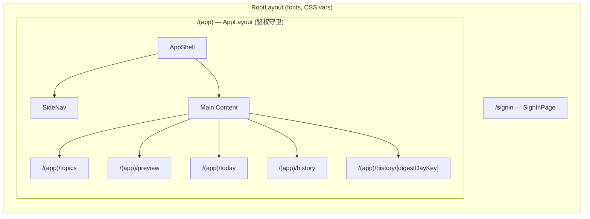
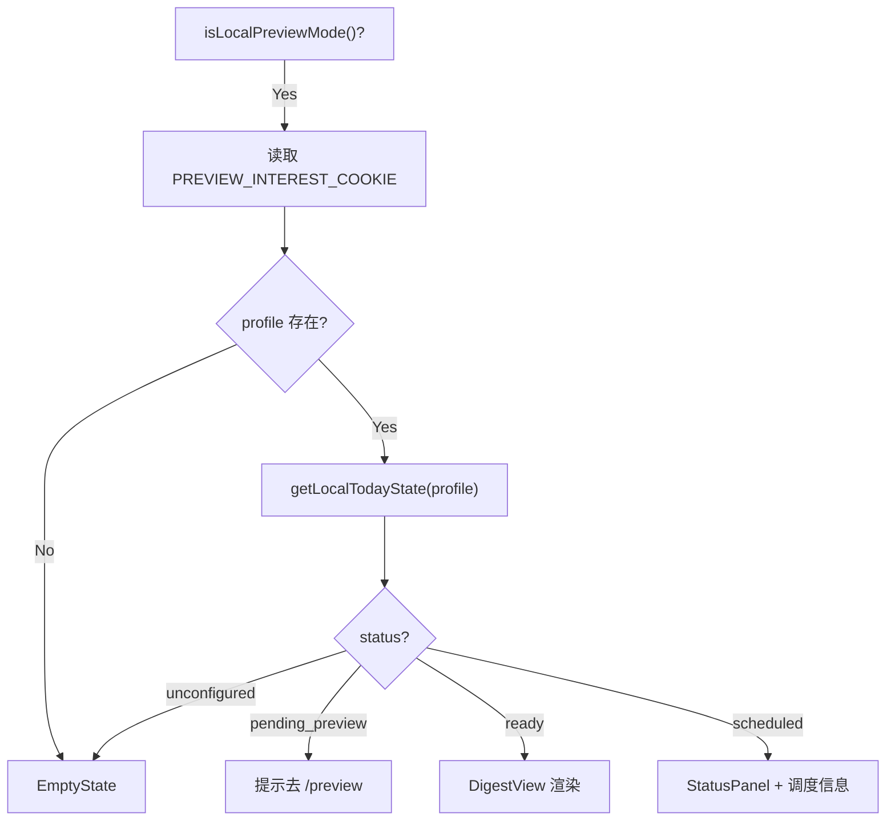
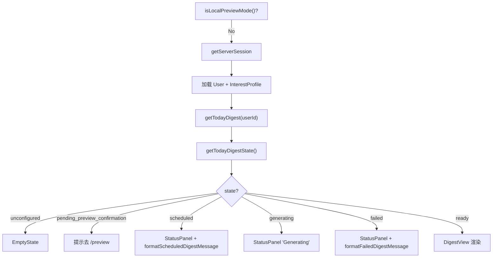

# 前端组件与页面路由

## 概述

Newsi 前端基于 Next.js 16 App Router 构建，采用 **Server Components 为主、Client Components 按需** 的混合渲染策略。所有需要认证的页面通过 `(app)` route group 集中鉴权，布局由 AppShell（SideNav + 主内容区）统一管理。

| 职责 | 关键文件 |
|------|---------|
| 根布局与字体 | `src/app/layout.tsx` |
| 鉴权守卫 | `src/app/(app)/layout.tsx:AppLayout()` |
| 布局容器 | `src/components/layout/app-shell.tsx:AppShell()` |
| 侧边导航 | `src/components/layout/side-nav.tsx:SideNav()` |
| 摘要渲染 | `src/components/digest/digest-view.tsx:DigestView()` |
| Markdown 渲染 | `src/components/digest/digest-markdown.tsx:DigestMarkdown()` |
| 骨架屏 | `src/components/digest/digest-skeleton.tsx:DigestSkeleton()` |
| 状态面板 | `src/components/states/status-panel.tsx:StatusPanel()` |
| 空状态 | `src/components/states/empty-state.tsx:EmptyState()` |

## 架构图



## 核心逻辑

### 1. 路由结构

| 路由 | 页面 | 说明 |
|------|------|------|
| `/signin` | SignInPage | 登录页，Google OAuth 按钮 + Preview Mode "Open preview" 链接 |
| `/(app)/topics` | TopicsPage | 兴趣配置表单 → 详见 [topics.md](topics.md) |
| `/(app)/preview` | PreviewPage | 预览生成 + 确认 → 详见 [preview.md](preview.md) |
| `/(app)/today` | TodayPage | 当日摘要展示（最复杂的页面） |
| `/(app)/history` | HistoryPage | 历史归档列表 |
| `/(app)/history/[digestDayKey]` | DigestDetailPage | 历史摘要详情 |

`(app)` 是 Next.js 的 **route group**——目录名带括号，不会出现在 URL 中，仅用于组织路由和共享布局。所有 `(app)` 下的页面共享 `AppLayout` 鉴权守卫。

### 2. 布局层级

```
RootLayout (src/app/layout.tsx)
  - 全局字体: Manrope (heading), IBM Plex Sans (body), IBM Plex Mono (mono)
  - CSS variables, TailwindCSS 4
  │
  ├── /signin — 独立页面，不经过 AppLayout
  │
  └── /(app) AppLayout (src/app/(app)/layout.tsx)
        - isLocalPreviewMode() → 跳过 session 检查
        - 否则: getServerSession → 无 session 则 redirect("/signin")
        │
        └── AppShell (src/components/layout/app-shell.tsx)
              - h-screen 全屏布局
              - 左侧: SideNav (导航 + 用户信息)
              - 右侧: main content area (overflow-y-auto)
              - 响应式: mobile 底部 border / desktop 右侧 border
              - user prop 可选: Preview Mode 下无用户信息也能渲染
```

### 3. Today 页面——最复杂的页面

`src/app/(app)/today/page.tsx:TodayPage()` 有两套**完全独立**的渲染路径：

**Local Preview Mode 路径：**



**Database Mode 路径：**



关键区别：
- Preview Mode 用 cookie 读取数据，DB Mode 用 Prisma 查询
- DB Mode 多出 `generating` 状态（Preview Mode 的生成是同步完成的 mock）
- 视图状态判断分别由 `getLocalTodayState()` 和 `getTodayDigestState()` 负责

### 4. 核心展示组件

**DigestView** (`src/components/digest/digest-view.tsx`) — Server Component

接收 `{ title, intro?, digestDate, topics[] }` 渲染完整摘要：
- 日期头部：monospace, uppercase, 带分隔线
- 标题：40px heading
- 简介：可选的 intro 段落
- Topic 区块：每个 topic 包含 h2 标题 + DigestMarkdown 渲染的 markdown 内容
- 页脚：sparkle 图标 + "End of Digest" 文字

**DigestMarkdown** (`src/components/digest/digest-markdown.tsx`)
- 封装 `react-markdown` + `remark-gfm` 插件
- 支持 GFM 扩展语法：表格、删除线、任务列表等

**DigestSkeleton** (`src/components/digest/digest-skeleton.tsx`)
- 摘要生成中的加载骨架屏
- 模拟 DigestView 的布局结构，避免 layout shift

**StatusPanel** (`src/components/states/status-panel.tsx`)
- 通用状态面板，接收 `{ label, body }`
- 用于 scheduled / generating / failed 等非内容状态
- label 显示为 uppercase 小标签，body 为说明文字

**EmptyState** (`src/components/states/empty-state.tsx`)
- 空状态引导，接收 `{ title, body }`
- 用于用户尚未配置 InterestProfile 时
- 引导用户去 /topics 配置兴趣

**PreviewActions / PreviewGenerationKickoff** — Client Components
- 预览相关的交互组件 → 详见 [preview.md](preview.md)

### 5. SideNav

`src/components/layout/side-nav.tsx:SideNav()` 侧边导航：
- 导航链接：Today、Topics、History
- 用户信息：头像、姓名、邮箱（仅 DB Mode 有数据）
- 响应式设计：mobile 水平底部导航 / desktop 垂直侧边栏

## 关键设计决策

| 决策 | 原因 |
|------|------|
| 用 `(app)` route group 集中鉴权 | 所有子页面自动受保护，无需每页重复 session 检查。添加新页面只需放在 `(app)` 目录下 |
| DigestView 是 Server Component | 纯展示组件，无需客户端交互和状态管理，减少 JS bundle |
| PreviewGenerationKickoff 是 Client Component | 需要 `useEffect` 发起 POST 请求和 `setInterval` 轮询 |
| Today 页面两套独立路径 | Preview Mode 和 DB Mode 的数据来源和状态模型完全不同，强行合并会导致条件嵌套混乱 |
| AppShell 的 user prop 设为可选 | Preview Mode 下无 session 信息，但布局仍需正常渲染 |
| 鉴权在 layout 而非 middleware | layout 是 Server Component，可以直接调用 `getServerSession`；middleware 运行在 Edge Runtime，能力受限 |

## 注意事项

- **`(app)/layout.tsx` 是唯一的鉴权守卫**，不是 Next.js middleware。所有 `(app)` 下的页面受其保护。
- **Today 页面是最复杂的页面**，有两套完整的独立渲染路径，修改时需要同时考虑两条路径。
- **Preview Mode 和 DB Mode 复用展示组件**（DigestView、StatusPanel 等），但数据获取路径完全不同。
- **字体配置**在 `src/app/layout.tsx` 中：Manrope（heading）、IBM Plex Sans（正文 UI）、IBM Plex Mono（monospace）。
- **DigestSkeleton 需要和 DigestView 保持布局一致**，修改 DigestView 布局时需同步更新骨架屏。
- **History 页面**相对简单：查询 `listArchivedDigests()` 按日期倒序 → 渲染列表 → 点击跳转详情页。
