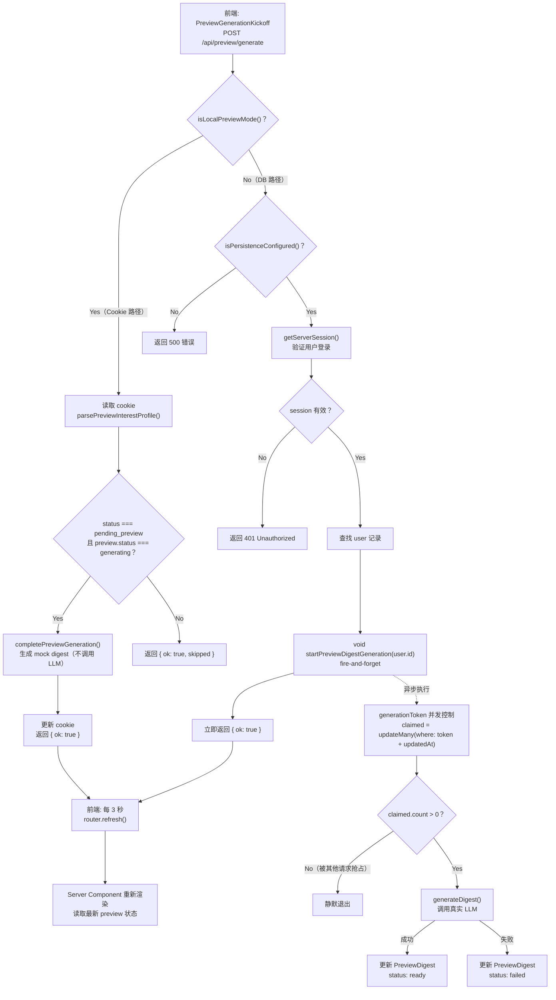

# 预览流程

## 概述

Preview 流程是用户在正式启用每日摘要（Daily Digest）之前，确认 AI 生成质量的关键门槛。用户配置好兴趣主题（Interest Profile）后，系统会生成一份预览摘要供用户审阅。只有用户确认预览质量满意后，系统才会激活定期的每日摘要生成。

整个 preview 流程围绕一个核心架构决策：**支持数据库驱动（DB 路径）和 cookie-based（Cookie 路径）两条完全独立的路径**。

- **DB 路径（生产模式）**：使用 Prisma 数据库存储 `PreviewDigest` 记录，调用真实的 LLM provider（如 Gemini）生成摘要内容，适用于配置了完整基础设施的生产环境。
- **Cookie 路径（Preview Mode）**：使用加密 HTTP-only cookie 存储状态，生成 mock 占位内容而非调用真正的 LLM，适用于本地开发和演示场景。

路径选择通过 `src/lib/env.ts` 中的 `isLocalPreviewMode()` 函数在运行时自动判定。两条路径共享相同的前端组件和 API 入口，但后端实现完全不同。

### 涉及的关键文件

| 文件路径 | 职责 |
|---------|------|
| `src/lib/preview-digest/service.ts` | DB 路径核心逻辑：生成、确认、重试、删除 PreviewDigest |
| `src/lib/preview-state.ts` | Cookie 路径核心逻辑：构建/解析 profile、生成 mock digest |
| `src/app/api/preview/generate/route.ts` | API 入口：POST handler，分流两条路径 |
| `src/components/preview/preview-generation-kickoff.tsx` | Client Component：触发生成请求 + 轮询刷新 |
| `src/components/preview/preview-actions.tsx` | Client Component：确认 / 重试按钮 + "Back to Topics" 链接 |
| `src/lib/env.ts` | 环境检测函数，决定走哪条路径 |
| `src/lib/digest/service.ts` | 通用 digest 生成逻辑（`generateDigest`），DB 路径调用 |

---

## 架构图

以下 Mermaid flowchart 展示了请求到达 `/api/preview/generate` 后的完整处理流程，包括双路径分流和前端轮询机制：



---

## 核心逻辑

### 1. 数据库路径（生产模式）

**源文件：** `src/lib/preview-digest/service.ts`

DB 路径使用 Prisma 模型 `PreviewDigest` 存储预览摘要的完整生命周期。该模块导出五个核心函数：

#### `startPreviewDigestGeneration(userId, { provider? })`

这是 preview 生成的核心入口。它被设计为**非阻塞异步**调用 -- API handler 通过 `void startPreviewDigestGeneration(user.id)` 以 fire-and-forget 方式调用，不等待生成完成。

```typescript
// src/lib/preview-digest/service.ts
export async function startPreviewDigestGeneration(
  userId: string,
  { provider }: { provider?: DigestProvider } = {},
) {
  // 1. 查找当前 PreviewDigest 记录
  const previewDigest = await db.previewDigest.findUnique({
    where: { userId },
  });

  // 必须存在且处于 "generating" 状态
  if (!previewDigest || previewDigest.status !== "generating") {
    return { started: false };
  }

  // 2. 并发控制：使用 generationToken + updatedAt 做乐观锁
  const claimed = await db.previewDigest.updateMany({
    where: {
      userId,
      status: "generating",
      generationToken: previewDigest.generationToken,
      updatedAt: previewDigest.updatedAt,
    },
    data: {
      updatedAt: new Date(),  // 更新时间戳，使后续并发请求的 where 条件不再匹配
    },
  });

  if (claimed.count === 0) {
    return { started: false };  // 被其他请求抢占，静默退出
  }

  // 3. 调用真实 LLM 生成摘要
  try {
    const digest = await generateDigest({
      provider,
      dateLabel: "Preview",
      interestText: previewDigest.interestTextSnapshot,
    });

    // 成功：写入完整结果
    await db.previewDigest.updateMany({
      where: { userId, generationToken: previewDigest.generationToken },
      data: {
        status: "ready",
        title: digest.title,
        intro: digest.intro,
        contentJson: digest,
        readingTime: digest.readingTime,
        providerName: provider?.name ?? null,
        providerModel: provider?.model ?? null,
        failureReason: null,
      },
    });
  } catch (error) {
    // 失败：记录错误原因
    await db.previewDigest.updateMany({
      where: { userId, generationToken: previewDigest.generationToken },
      data: {
        status: "failed",
        failureReason: getErrorMessage(error),
      },
    });
  }

  return { started: true };
}
```

**并发控制机制详解：**

并发问题发生在用户快速点击或网络重试导致多个 `startPreviewDigestGeneration` 调用同时执行的场景。系统使用 `generationToken`（UUID）和 `updatedAt` 时间戳组成的复合条件作为乐观锁：

1. 第一个请求读取到 `previewDigest.generationToken` 和 `previewDigest.updatedAt`。
2. 第一个请求成功执行 `updateMany`，将 `updatedAt` 更新为当前时间。`claimed.count === 1`。
3. 第二个并发请求使用旧的 `updatedAt` 值执行 `updateMany`，由于时间戳已经不匹配，`claimed.count === 0`，请求被静默忽略。

这避免了同一个 preview 被多次生成导致资源浪费和状态不一致。

#### `confirmPreviewDigest(userId)`

用户审阅 preview 后确认满意时调用。该函数在一个数据库事务中完成三个操作：

```typescript
// src/lib/preview-digest/service.ts
export async function confirmPreviewDigest(userId: string, now = new Date()) {
  // 1. 校验 preview 状态
  const previewDigest = await db.previewDigest.findUnique({ where: { userId } });
  if (!previewDigest || previewDigest.status !== "ready") {
    throw new Error("Preview digest is not ready yet.");
  }

  // 2. 校验 interestText 一致性（防止过期 preview）
  const interestProfile = await db.interestProfile.findUnique({ where: { userId } });
  if (interestProfile.interestText !== previewDigest.interestTextSnapshot) {
    throw new Error("Preview digest is stale. Regenerate it from the latest Topics.");
  }

  // 3. 事务操作
  const digestDayKey = getBeijingDigestDayKey(now);           // 今天
  const firstEligibleDigestDayKey = getNextBeijingDigestDayKey(now); // 明天

  await db.$transaction(async (tx) => {
    // 3a. 创建/更新 DailyDigest（将 preview 内容升格为正式的每日摘要）
    await tx.dailyDigest.upsert({
      where: { userId_digestDayKey: { userId, digestDayKey } },
      update: { status: "ready", title: ..., intro: ..., contentJson: ..., ... },
      create: { userId, digestDayKey, status: "ready", ... },
    });

    // 3b. 激活 InterestProfile
    await tx.interestProfile.update({
      where: { userId },
      data: { status: "active", firstEligibleDigestDayKey },
    });

    // 3c. 删除 PreviewDigest（一次性使用）
    await tx.previewDigest.delete({ where: { userId } });
  });
}
```

`interestText` 一致性校验是一个重要的防护措施：如果用户先生成了 preview，然后回到 Topics 页面修改了兴趣主题，再回来确认旧的 preview，系统会拒绝该操作并提示用户重新生成。这确保了用户确认的摘要内容始终基于最新的兴趣设置。

#### `retryPreviewDigest(userId)`

当 preview 生成失败时，用户可以点击 "Try again" 按钮触发重试。该函数重置 `PreviewDigest` 记录到初始状态：

```typescript
// src/lib/preview-digest/service.ts
export async function retryPreviewDigest(userId: string) {
  await db.previewDigest.update({
    where: { userId },
    data: {
      status: "generating",
      generationToken: randomUUID(),  // 生成新 token，使旧的并发请求失效
      title: null,
      intro: null,
      contentJson: Prisma.DbNull,
      readingTime: null,
      providerName: null,
      providerModel: null,
      failureReason: null,
    },
  });
}
```

注意这里生成了新的 `generationToken`。这意味着如果旧的生成请求还在执行中，它写入结果时会因 token 不匹配而不会覆盖新一轮的生成状态。

#### `deletePreviewDigest(userId)` 和 `getPreviewDigest(userId)`

`deletePreviewDigest` 执行硬删除（`deleteMany`）。`getPreviewDigest` 查询记录并通过 `parseStoredDigestContent` 解析 `contentJson` 字段为结构化的 `DigestResponse` 对象。

---

### 2. Cookie 路径（Preview Mode）

**源文件：** `src/lib/preview-state.ts`

Cookie 路径不依赖数据库和 LLM provider，所有状态存储在名为 `newsi-preview-interest-profile`（常量 `PREVIEW_INTEREST_COOKIE`）的加密 HTTP-only cookie 中。

#### 数据结构

Cookie 中存储的 `PreviewInterestProfile` 使用 Zod schema 验证：

```typescript
// src/lib/preview-state.ts
const previewInterestProfileSchema = z.object({
  interestText: z.string().min(1),
  timezone: z.string().min(1),
  firstEligibleDigestDayKey: z.string().regex(/^\d{4}-\d{2}-\d{2}$/),
  status: z.enum(["pending_preview", "active"]),
  preview: previewDigestSchema,
  activeDigest: activePreviewDigestSchema.optional(),
});
```

状态流转为：`pending_preview`（等待预览） -> `active`（已激活每日摘要）。

#### `buildPreviewInterestProfile({ interestText, browserTimezone })`

创建初始 profile，status 设为 `"pending_preview"`，preview 状态设为 `"generating"`，并生成一个 `generationToken`（UUID）。同时根据用户时区和当前时间计算 `firstEligibleDigestDayKey`。

#### `completePreviewGeneration(profile, generationToken)`

Cookie 路径的核心生成函数。与 DB 路径不同，它**不调用真正的 LLM**，而是调用 `buildPreviewDigest(interestText)` 生成 mock 占位内容：

```typescript
// src/lib/preview-state.ts
export function completePreviewGeneration(
  profile: PreviewInterestProfile,
  generationToken: string,
) {
  // 校验 token 和 status 匹配
  if (
    profile.status !== "pending_preview" ||
    profile.preview.status !== "generating" ||
    profile.preview.generationToken !== generationToken
  ) {
    return profile;  // 条件不满足，返回原 profile 不做修改
  }

  return {
    ...profile,
    preview: {
      status: "ready",
      generationToken,
      digest: buildPreviewDigest(profile.interestText),
    },
  };
}
```

`buildPreviewDigest` 内部通过解析 `interestText`（按逗号和换行符分割）提取 focus areas，为每个 focus area 生成一个包含 "Top Events" 和 "Summary" 的占位 topic。最多取前 3 个 focus areas；不足 3 个时使用 "Primary Focus"、"Emerging Signals"、"Why It Matters" 等默认名称填充。

#### `confirmPreviewInterestProfile(profile)`

确认操作：将 status 设为 `"active"`，将 preview digest 移入 `activeDigest` 字段，更新 `firstEligibleDigestDayKey` 为明天。

```typescript
// src/lib/preview-state.ts
export function confirmPreviewInterestProfile(
  profile: PreviewInterestProfile,
  now = new Date(),
) {
  const previewDigest = profile.preview.digest;

  if (profile.preview.status !== "ready" || !previewDigest) {
    throw new Error("Preview digest is not ready yet.");
  }

  return {
    ...profile,
    firstEligibleDigestDayKey: getNextDigestDayKey(profile.timezone, now),
    status: "active",
    preview: {
      status: "ready",
      generationToken: profile.preview.generationToken,
    },
    activeDigest: {
      digestDayKey: getDigestDayKey(profile.timezone, now),
      digest: previewDigest,
    },
  };
}
```

#### 状态查询函数

- **`getLocalTodayState(profile)`**：返回 `LocalTodayState` 联合类型，可能的状态为 `unconfigured`（无 profile）、`pending_preview`（等待预览）、`ready`（今天的 digest 已就绪）、`scheduled`（已安排但今天的 digest 尚未生成）。
- **`getLocalArchiveItems(profile)`**：返回归档条目列表。如果存在 `activeDigest`，返回包含该 digest 信息的单元素数组。

---

### 3. API 入口

**源文件：** `src/app/api/preview/generate/route.ts`

POST handler 是整个 preview 生成流程的统一入口，通过 `isLocalPreviewMode()` 分流到两条路径：

```typescript
// src/app/api/preview/generate/route.ts
export async function POST() {
  if (isLocalPreviewMode()) {
    // === Cookie 路径 ===
    const cookieStore = await cookies();
    const profile = parsePreviewInterestProfile(
      cookieStore.get(PREVIEW_INTEREST_COOKIE)?.value,
    );

    if (!profile || profile.status !== "pending_preview") {
      return Response.json({ ok: true, skipped: "no-preview" });
    }

    if (profile.preview.status === "generating") {
      const nextProfile = completePreviewGeneration(
        profile,
        profile.preview.generationToken,
      );
      cookieStore.set(PREVIEW_INTEREST_COOKIE, JSON.stringify(nextProfile), {
        httpOnly: true,
        sameSite: "lax",
        path: "/",
        maxAge: 60 * 60 * 24 * 30,  // 30 天
      });
    }

    return Response.json({ ok: true });
  }

  // === DB 路径 ===
  if (!db) {
    return Response.json({ ok: false, error: "Persistence is not configured." }, { status: 500 });
  }

  const session = await getServerSession(authOptions);
  if (!session?.user?.email) {
    return Response.json({ ok: false, error: "Unauthorized" }, { status: 401 });
  }

  const user = await db.user.findUnique({
    where: { email: session.user.email },
  });
  if (!user) {
    return Response.json({ ok: false, error: "Unauthorized" }, { status: 401 });
  }

  // fire-and-forget：void 关键字表示不等待 Promise 完成
  void startPreviewDigestGeneration(user.id);

  return Response.json({ ok: true });
}
```

**两条路径的关键差异：**

| 维度 | DB 路径 | Cookie 路径 |
|------|---------|-------------|
| 状态存储 | Prisma `PreviewDigest` 表 | HTTP-only cookie |
| 摘要生成 | 真实 LLM 调用（`generateDigest`） | Mock 占位内容（`buildPreviewDigest`） |
| 异步模型 | fire-and-forget，API 立即返回 | 同步完成，API 返回前已写入 cookie |
| 鉴权 | `getServerSession` + 用户查找 | 无鉴权（Preview Mode 跳过） |
| 生成耗时 | 数秒到数十秒（取决于 LLM） | 瞬时完成 |

---

### 4. 前端轮询

**源文件：** `src/components/preview/preview-generation-kickoff.tsx`、`src/components/preview/preview-actions.tsx`

#### `PreviewGenerationKickoff`

这是一个不渲染任何可见 UI 的 Client Component（`return null`）。它的职责是在挂载时触发 preview 生成请求，然后通过轮询刷新服务端数据。

```typescript
// src/components/preview/preview-generation-kickoff.tsx
const previewGenerationRequests = new Map<string, Promise<boolean>>();

export function PreviewGenerationKickoff({
  generationToken,
}: {
  generationToken: string;
}) {
  const router = useRouter();

  useEffect(() => {
    // 防重复：如果该 token 已有进行中的请求，复用它
    let request = previewGenerationRequests.get(generationToken);

    if (!request) {
      request = fetch("/api/preview/generate", { method: "POST" })
        .then((response) => {
          if (!response.ok) {
            previewGenerationRequests.delete(generationToken);
            return false;
          }
          return true;
        })
        .catch(() => {
          previewGenerationRequests.delete(generationToken);
          return false;
        });

      previewGenerationRequests.set(generationToken, request);
    }

    let cancelled = false;
    let pollInterval: ReturnType<typeof setInterval> | null = null;

    void request.then((ok) => {
      if (cancelled || !ok) return;

      router.refresh();  // 立即刷新一次
      pollInterval = setInterval(() => {
        router.refresh();  // 每 3 秒刷新
      }, 3000);
    });

    return () => {
      cancelled = true;
      if (pollInterval) clearInterval(pollInterval);
    };
  }, [generationToken, router]);

  return null;
}
```

**防重复机制详解：**

组件使用模块级 `Map<string, Promise<boolean>>`（而非 `Set`）追踪已发起的请求。选择 `Map` 而非 `Set` 有两个原因：

1. **存储 Promise 引用**：当相同 `generationToken` 的组件因 React StrictMode 双重挂载而再次执行 `useEffect` 时，可以复用已有的 Promise 而非发起新请求。
2. **StrictMode 安全**：StrictMode 在开发环境下会 mount -> unmount -> mount 组件。如果只用 `Set` 标记"已发起"，第一次 unmount 时的 cleanup 无法清除 `Set` 中的标记（因为请求仍在进行中），而 `Map` 存储了 Promise 本身，第二次 mount 时可以直接 `.get` 获取并 `.then` 链接到现有请求上。

#### `PreviewActions`

渲染确认和重试操作按钮的 Server/Client Component：

```typescript
// src/components/preview/preview-actions.tsx
export function PreviewActions({
  onConfirmAction,
  onRetryAction,
  canConfirm = false,
  canRetry = false,
}) {
  return (
    <div>
      {canConfirm && onConfirmAction ? (
        <form action={onConfirmAction}>
          <button>Confirm and start daily digests</button>
        </form>
      ) : null}
      {canRetry && onRetryAction ? (
        <form action={onRetryAction}>
          <button>Try again</button>
        </form>
      ) : null}
      <Link href="/topics">Back to Topics</Link>
    </div>
  );
}
```

按钮使用 `<form action={serverAction}>` 模式，`onConfirmAction` 和 `onRetryAction` 是 Server Actions，由父级 Server Component 传入。`canConfirm` 和 `canRetry` 控制按钮的显示条件（通常基于 preview 的当前状态：`ready` 时可确认，`failed` 时可重试）。

---

## 关键设计决策

### 为什么采用双路径设计？

双路径设计服务于两个不同的受众：

- **Cookie 路径（Preview Mode）**：面向开发者。Clone 项目后无需配置数据库、OAuth credentials 或 LLM API key，`pnpm dev` 即可体验完整的 preview 流程。mock digest 提供了足够真实的 UI 体验，让前端开发和 UI 调试不受后端依赖阻塞。
- **DB 路径（生产模式）**：面向真实用户。使用数据库持久化保证了状态的可靠性和跨设备一致性，真实的 LLM 调用确保用户看到的 preview 质量能代表正式摘要的水平。

### 为什么使用 fire-and-forget 模式？

DB 路径中，API handler 使用 `void startPreviewDigestGeneration(user.id)` 发起生成请求后立即返回 `{ ok: true }`。这是因为 LLM 调用可能耗时数秒甚至数十秒，如果 API handler 等待生成完成，HTTP 请求可能超时。

fire-and-forget 模式将生成过程与请求-响应周期解耦：API 立即返回，前端通过 `PreviewGenerationKickoff` 每 3 秒轮询 `router.refresh()` 获取最新状态。这避免了长连接超时问题，同时为用户提供了"正在生成"的视觉反馈。

### 为什么需要 interestText 一致性校验？

`confirmPreviewDigest` 在执行前会比较 `PreviewDigest.interestTextSnapshot` 与当前 `InterestProfile.interestText`。这防止了以下场景：

1. 用户配置兴趣为 "AI, 金融科技"，触发 preview 生成。
2. preview 生成期间，用户回到 Topics 页面将兴趣改为 "量子计算, 生物技术"。
3. preview 基于旧的 "AI, 金融科技" 生成完毕。
4. 用户确认该 preview -- 但此时 preview 内容与当前兴趣不匹配。

一致性校验在步骤 4 拦截了这个操作，抛出 "Preview digest is stale" 错误，引导用户基于新兴趣重新生成 preview。

### 为什么使用 generationToken 做并发控制？

每次生成（包括初始生成和 retry）都会创建一个新的 UUID 作为 `generationToken`。这个 token 配合 `updatedAt` 时间戳在 `updateMany` 的 `where` 条件中构成乐观锁。

这种设计确保了：

- **同一轮生成的多个并发请求**只有一个能成功 claim 任务（通过 `updatedAt` 时间戳）。
- **跨轮次的请求**（旧轮次的请求在 retry 生成新 token 后才完成）无法覆盖新轮次的状态（通过 `generationToken` 不匹配）。

### 为什么 Cookie 路径使用 mock digest 而非真实 LLM？

Cookie 路径的定位是零依赖的本地开发体验。如果它也调用 LLM，开发者就需要配置 LLM API key，这与 "降低上手门槛" 的目标矛盾。mock digest 通过解析用户输入的 `interestText` 生成结构化的占位内容，让开发者能完整走通 preview -> confirm -> daily digest 的流程，验证 UI 逻辑和状态流转的正确性。

---

## 注意事项

### Cookie 路径的 mock digest 是占位内容

Cookie 路径生成的 mock digest（`buildPreviewDigest`）是基于 focus areas 拼接的静态文本，不反映真实 AI 生成质量。它的标题固定为 "Today's Synthesis"，每个 topic 都是模板化的占位段落。不要将 mock digest 的内容作为 AI 摘要质量的参考。

### 并发控制依赖 token 匹配

`startPreviewDigestGeneration` 中的并发控制依赖 `generationToken` 和 `updatedAt` 的精确匹配。token 不匹配的请求会被静默忽略（返回 `{ started: false }`），不会抛出错误。这意味着并发冲突不会产生可见的错误日志，调试时需要注意检查返回值。

### confirm 操作会删除 PreviewDigest 记录

`confirmPreviewDigest` 在事务中执行 `previewDigest.delete`，将 preview 内容升格为 `DailyDigest` 后立即删除源记录。这是一次性设计 -- PreviewDigest 只在 preview 阶段存在，一旦确认就被转换为正式的每日摘要。

### PreviewGenerationKickoff 的 Map 追踪机制

`previewGenerationRequests` 是模块级 `Map`，生命周期与页面一致（SPA 导航不会清除）。每个 `generationToken` 对应一个 `Promise<boolean>`。请求成功后 Promise resolve 为 `true`，失败则 resolve 为 `false` 并从 Map 中删除（允许下次重试）。成功的 Promise 不会被删除，因此同一 `generationToken` 的后续 mount 不会发起重复请求。

### retry 会完全重置状态

`retryPreviewDigest` 不仅重置 `status` 为 `"generating"`，还清空所有结果字段（`title`、`intro`、`contentJson`、`readingTime`、`providerName`、`providerModel`、`failureReason`），并生成全新的 `generationToken`。这确保了 retry 是一次干净的重新开始，不会残留上一次失败的数据。

### Cookie 过期时间

Cookie 路径中，`PREVIEW_INTEREST_COOKIE` 设置了 `maxAge: 60 * 60 * 24 * 30`（30 天）。这意味着如果开发者 30 天内没有访问应用，preview 状态会丢失。对于持久化需求，应使用 DB 路径。

### 时区处理差异

DB 路径使用 `getBeijingDigestDayKey` 和 `getNextBeijingDigestDayKey`（固定北京时区），而 Cookie 路径使用 `getDigestDayKey` 和 `getNextDigestDayKey`（基于用户浏览器时区，通过 `normalizeTimezone` 处理）。这是因为 DB 路径服务于统一的生产环境调度系统，而 Cookie 路径需要适配本地开发者的时区。
