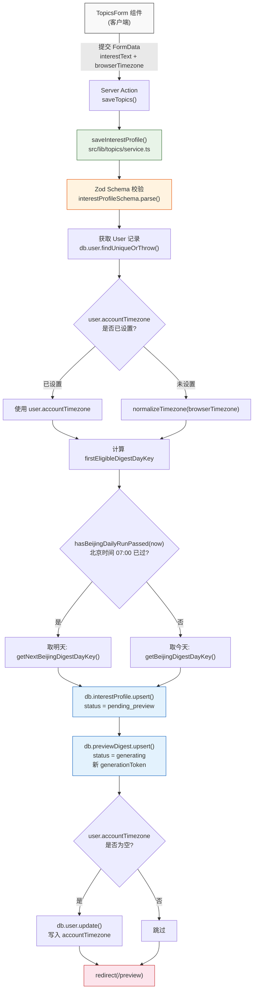
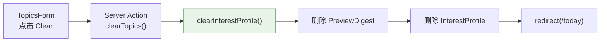

# 兴趣配置

## 概述

用户兴趣配置模块（Topics）管理 Standing Brief 的创建、修改和清除。Standing Brief 是用户用自然语言撰写的兴趣描述，作为 LLM 生成每日新闻摘要的核心输入。这是整个摘要生成流程的起点——用户在 `/topics` 页面提交 Standing Brief 后，系统立即创建 InterestProfile 和 PreviewDigest 记录，并跳转到 `/preview` 页面展示生成的预览摘要。

模块涉及的核心文件：

| 文件 | 职责 |
|---|---|
| `src/lib/topics/schema.ts` | Zod Schema 输入校验 |
| `src/lib/topics/service.ts` | 业务逻辑：`saveInterestProfile()`、`clearInterestProfile()` |
| `src/components/topics/topics-form.tsx` | 客户端表单组件 `TopicsForm` |
| `src/app/(app)/topics/page.tsx` | 页面路由：Server Actions 串联表单与 service 层 |
| `src/lib/timezone.ts` | 时区工具函数 |
| `src/lib/preview-state.ts` | 本地预览模式（无数据库时）的状态管理 |

## 架构图



清除兴趣的流程相对简单：



## 核心逻辑

### 1. Zod Schema 校验

**文件**: `src/lib/topics/schema.ts:interestProfileSchema`

```typescript
export const interestProfileSchema = z.object({
  interestText: z.string().trim().min(2).max(1000),
  browserTimezone: z.string().trim().optional(),
});
```

校验规则：

- `interestText`: 字符串类型，自动 trim 前后空白，最少 2 个字符，最多 1000 个字符
- `browserTimezone`: 字符串类型，自动 trim，可选字段

`interestProfileSchema.parse(input)` 会在校验失败时抛出 `ZodError`，调用方需要处理此异常。由于 `saveInterestProfile()` 的 `input` 参数类型为 `unknown`，Zod 同时承担了类型收窄（type narrowing）的职责。

### 2. saveInterestProfile()

**文件**: `src/lib/topics/service.ts:saveInterestProfile()`

这是模块的核心函数，完整流程如下：

**步骤 1 -- 校验输入**

```typescript
const data = interestProfileSchema.parse(input);
```

对原始输入进行 Zod 校验，确保 `interestText` 和 `browserTimezone` 符合约束。校验失败直接抛出异常。

**步骤 2 -- 获取用户**

```typescript
const user = await db.user.findUniqueOrThrow({ where: { id: userId } });
```

通过 `findUniqueOrThrow` 确保用户存在，不存在则抛出 Prisma `NotFoundError`。

**步骤 3 -- 确定时区**

```typescript
const timezone = user.accountTimezone ?? normalizeTimezone(data.browserTimezone);
```

优先使用用户已保存的 `accountTimezone`。如果用户是首次设置（`accountTimezone` 为 `null`），则使用浏览器端传入的 `browserTimezone` 经过 `normalizeTimezone()` 验证后的值。`normalizeTimezone()` 的逻辑是：尝试用 `Intl.DateTimeFormat` 验证时区字符串的合法性，不合法则回退到 `"UTC"`。

**步骤 4 -- 计算 firstEligibleDigestDayKey**

```typescript
const now = new Date();
const firstEligibleDigestDayKey = hasBeijingDailyRunPassed(now)
  ? getNextBeijingDigestDayKey(now)
  : getBeijingDigestDayKey(now);
```

这决定了用户的第一个每日摘要从哪天开始生成：

- 如果当前北京时间已过 07:00（每日 Cron 运行时间）：取**明天**的 dayKey，因为今天的批次已经运行过了
- 如果尚未到 07:00：取**今天**的 dayKey，今天的批次还会运行

**步骤 5 -- Upsert InterestProfile**

```typescript
await db.interestProfile.upsert({
  where: { userId },
  update: {
    interestText: data.interestText,
    status: "pending_preview",
  },
  create: {
    userId,
    interestText: data.interestText,
    status: "pending_preview",
    firstEligibleDigestDayKey,
  },
});
```

关键细节：
- `status` 始终显式设为 `"pending_preview"`，不论是新建还是更新
- `firstEligibleDigestDayKey` 只在 `create` 时设置；`update` 时不修改此字段，保持首次设置的值
- 这意味着用户反复修改 Standing Brief 不会重置起始日期

**步骤 6 -- Upsert PreviewDigest**

```typescript
await db.previewDigest.upsert({
  where: { userId },
  update: {
    generationToken: randomUUID(),
    interestTextSnapshot: data.interestText,
    status: "generating",
    title: null,
    intro: null,
    contentJson: Prisma.DbNull,
    readingTime: null,
    providerName: null,
    providerModel: null,
    failureReason: null,
  },
  create: {
    userId,
    generationToken: randomUUID(),
    interestTextSnapshot: data.interestText,
    status: "generating",
  },
});
```

关键细节：
- 每次调用都生成新的 `generationToken`（`randomUUID()`），这会使正在进行的旧生成任务失效
- `interestTextSnapshot` 保存当前的兴趣文本，后续 `confirmPreviewDigest()` 会用它做一致性校验
- `update` 时显式清空所有结果字段（title、intro、contentJson、readingTime 等），确保旧的预览结果不会残留
- 使用 `Prisma.DbNull` 而非 JavaScript `null` 来清空 JSON 类型字段，这是 Prisma 对 JSON 字段的特殊要求

**步骤 7 -- 写入用户时区（仅首次）**

```typescript
if (!user.accountTimezone) {
  await db.user.update({
    where: { id: userId },
    data: { accountTimezone: timezone },
  });
}
```

仅当用户尚未设置 `accountTimezone` 时才写入。一旦设置，后续调用 `saveInterestProfile()` 不会修改此值。如需更改时区，需要直接更新 User 记录。

### 3. InterestProfile 状态机

InterestProfile 的 `status` 有两个值，构成一个简单的状态机：

| 状态 | 含义 | 设置者 |
|---|---|---|
| `pending_preview` | 用户已保存兴趣但尚未确认预览 | `saveInterestProfile()` |
| `active` | 预览已确认，Cron 可为该用户生成每日摘要 | `confirmPreviewDigest()` |

状态流转：

```
pending_preview ──(确认预览)──> active ──(修改兴趣)──> pending_preview
```

Prisma Schema 中 `status` 的默认值是 `@default(active)`，但 `saveInterestProfile()` 总是显式设为 `"pending_preview"`。Schema 默认值仅为数据库直接操作（如 seed 脚本）提供合理回退。

`runDigestGenerationCycle()` 只扫描 `status = "active"` 的 InterestProfile，因此处于 `pending_preview` 状态的用户不会收到每日摘要。这确保了每次修改兴趣后用户都必须经过预览确认流程。

### 4. clearInterestProfile()

**文件**: `src/lib/topics/service.ts:clearInterestProfile()`

```typescript
export async function clearInterestProfile(userId: string) {
  await db.previewDigest.deleteMany({ where: { userId } });
  await db.interestProfile.deleteMany({ where: { userId } });
}
```

清除逻辑：

1. 先删除 PreviewDigest（如果存在）
2. 再删除 InterestProfile

重要：**不删除 DailyDigest**。用户已生成的历史摘要作为归档保留，用户可以继续在 `/history` 页面查看过去的摘要。DailyDigest 仅在 User 被删除时通过 Prisma 的 `onDelete: Cascade` 级联删除。

删除顺序也有讲究——先删 PreviewDigest 再删 InterestProfile，因为两者没有数据库层面的外键依赖（都直接关联 User），但逻辑上 PreviewDigest 依赖 InterestProfile 的存在，先删除它更为清晰。

### 5. TopicsForm 组件

**文件**: `src/components/topics/topics-form.tsx`

```typescript
export function TopicsForm({ initialValue, onSubmitAction, onClearAction }: {
  initialValue: string;
  onSubmitAction: (formData: FormData) => void | Promise<void>;
  onClearAction: () => void | Promise<void>;
}) {
  const timezone = Intl.DateTimeFormat().resolvedOptions().timeZone || "UTC";
  // ...
}
```

关键实现：

- 使用 `"use client"` 标记为客户端组件
- 浏览器时区通过 `Intl.DateTimeFormat().resolvedOptions().timeZone` 在客户端检测，作为 hidden input 传入 Server Action
- `initialValue` 从 InterestProfile 的 `interestText` 加载，支持编辑已有的 Standing Brief
- `onClearAction` 仅在 `initialValue.trim()` 非空时显示清除按钮

### 6. 页面路由与 Server Actions

**文件**: `src/app/(app)/topics/page.tsx`

页面支持两种运行模式：

**数据库模式**（生产环境）：
- 通过 NextAuth `getServerSession()` 获取用户身份
- 调用 `saveInterestProfile()` / `clearInterestProfile()` 操作数据库
- 保存后 `revalidatePath()` 刷新 `/topics`、`/today`、`/preview` 的缓存
- 保存后 `redirect("/preview")` 跳转预览页，清除后 `redirect("/today")` 跳转今日页

**本地预览模式**（无数据库时）：
- 通过 `isLocalPreviewMode()` 判断
- 使用 cookie（`PREVIEW_INTEREST_COOKIE`）存储兴趣配置
- 调用 `buildPreviewInterestProfile()` 构建本地状态对象
- 预览模式下的状态管理由 `src/lib/preview-state.ts` 负责

### 7. 语言检测

Standing Brief 的语言会直接传递到 LLM prompt。Prompt 中指示 LLM "match the language of the standing brief"，因此：

- 用户写中文 Standing Brief → 摘要以中文生成
- 用户写英文 Standing Brief → 摘要以英文生成
- 混合语言 → LLM 自行判断主要语言

系统不做显式的语言检测或语言字段存储，完全依赖 LLM 的语言跟随能力。

### 8. 时区处理

时区在兴趣配置模块中的完整流转：

1. 浏览器端通过 `Intl.DateTimeFormat().resolvedOptions().timeZone` 检测用户时区
2. 作为 `browserTimezone` 通过 FormData 传入 Server Action
3. `normalizeTimezone()` 验证时区字符串是否为合法的 IANA 时区标识符（如 `"Asia/Shanghai"`、`"America/New_York"`），不合法则回退到 `"UTC"`
4. 首次保存时写入 `User.accountTimezone`，后续不再更新
5. 时区影响 `firstEligibleDigestDayKey` 的计算（但注意：dayKey 的计算本身始终基于北京时区 `Asia/Shanghai`，用户时区主要用于未来可能的扩展）

## 关键设计决策

### saveInterestProfile 同时创建 PreviewDigest

一步操作同时创建 InterestProfile 和 PreviewDigest。这样用户保存兴趣后可以立即跳转到 `/preview` 页面，页面检测到 `status = "generating"` 的 PreviewDigest 后触发异步生成。不需要额外的用户操作步骤。

### clearInterestProfile 不删除 DailyDigest

保留历史记录是有意的设计。用户清除兴趣后可以重新配置，且仍然可以在 `/history` 页面查看过去生成的摘要。只有删除整个用户账号时，才通过 Prisma `onDelete: Cascade` 级联清理所有数据。

### firstEligibleDigestDayKey 仅在 create 时设置

InterestProfile 的 `upsert` 操作中，`firstEligibleDigestDayKey` 只出现在 `create` 分支，`update` 分支不包含此字段。这意味着用户反复修改 Standing Brief 不会重置起始日期。起始日期由首次创建时的时间决定，后续通过 `confirmPreviewDigest()` 在事务中更新为确认时的次日。

### status 总是设为 pending_preview

即使 Prisma Schema 定义了 `@default(active)`，代码层始终显式设置 `status = "pending_preview"`。这确保了每次修改兴趣都必须经过预览确认流程，防止用户在未查看预览的情况下直接进入每日摘要生成。

### generationToken 实现乐观锁

每次 `saveInterestProfile()` 都生成新的 `generationToken`（UUID），这使得正在进行中的旧预览生成任务在尝试写回结果时会因为 token 不匹配而安全放弃。`startPreviewDigestGeneration()` 使用 `updateMany` + `generationToken` + `updatedAt` 条件来 claim 生成任务，避免并发竞态。

### Prisma.DbNull 用于清空 JSON 字段

在 `update` 分支中，`contentJson` 使用 `Prisma.DbNull` 而非 JavaScript `null`。这是 Prisma 对 JSON 类型字段的特殊处理——JavaScript `null` 会被 Prisma 解释为 JSON 的 `null` 值（即在数据库中存储 JSON `null`），而 `Prisma.DbNull` 才是将列设为 SQL `NULL`。

## 注意事项

1. **firstEligibleDigestDayKey 取决于北京时间 07:00**。`hasBeijingDailyRunPassed()` 检查当前是否已过北京时间 07:00（`DIGEST_RUN_HOUR = 7`）。如果在 Cron 运行时间之后保存兴趣，首个每日摘要将从明天开始；如果在运行时间之前保存，今天就可以收到。

2. **修改兴趣后，PreviewDigest 的所有结果字段被清空**。`generationToken` 重新生成，`status` 重置为 `"generating"`，title、intro、contentJson、readingTime、providerName、providerModel、failureReason 全部设为 `null`/`DbNull`。这确保用户看到的是最新兴趣对应的预览，不会残留旧结果。

3. **interestText 的长度约束是 2-1000 字符**。最短 2 字符的限制允许用户用极短的关键词描述兴趣（如 "AI"），最长 1000 字符足够容纳较详细的兴趣描述。这些限制在 Zod Schema 中定义，在 `saveInterestProfile()` 入口处强制执行。

4. **accountTimezone 一旦设置就不再通过 saveInterestProfile 更新**。代码中 `if (!user.accountTimezone)` 的判断确保了这一点。如果用户需要更改时区，需要通过其他途径（直接修改 User 记录）完成。

5. **本地预览模式的差异**。当 `isLocalPreviewMode()` 返回 `true` 或 `db` 为 `null` 时，`/topics` 页面使用 cookie 替代数据库存储。此模式下时区处理使用用户本地时区（而非固定北京时区），状态管理由 `src/lib/preview-state.ts` 中的纯函数完成。开发和调试时需注意两种模式的行为差异。

6. **confirmPreviewDigest 中的一致性校验**。在 `src/lib/preview-digest/service.ts:confirmPreviewDigest()` 中，系统会比对 `interestProfile.interestText` 与 `previewDigest.interestTextSnapshot`。如果用户在预览生成后修改了 Standing Brief，确认操作会抛出 `"Preview digest is stale"` 错误，要求用户重新生成预览。

7. **Server Action 中的 revalidatePath**。保存兴趣后会 revalidate `/topics`、`/today`、`/preview` 三个路径；清除兴趣后会 revalidate `/topics`、`/today`、`/history`。这确保了相关页面的 Server Component 缓存被正确刷新。
